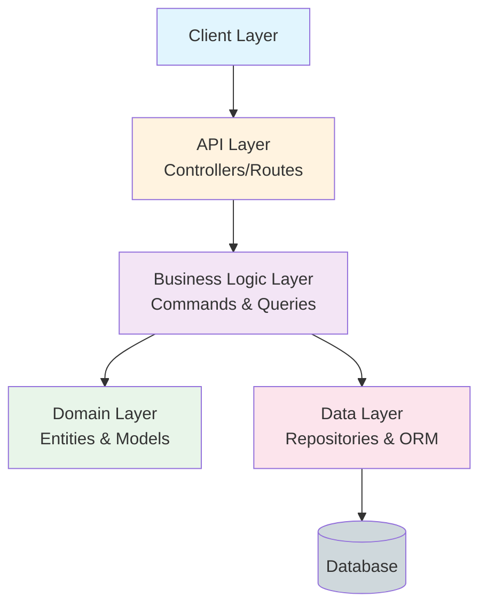

# Multi-Agent Ultra-Comprehensive Codebase Map

**Generated:** 2026-01-26 17:42:38
**Analyzer:** Multi-Agent Ultra-Comprehensive Analyzer (Language-Agnostic)

---

## Table of Contents

1. [Executive Summary](#executive-summary)
2. [Architecture Overview](#architecture-overview)
3. [Technology Stack](#technology-stack)
4. [Component Catalog](#component-catalog)
5. [API Specifications](#api-specifications)
6. [Data Models](#data-models)
7. [Business Logic](#business-logic)
8. [Development Guide](#development-guide)

---

## Executive Summary

### Key Statistics

| Metric | Value |
|--------|-------|
| **Total Files** | 269 |
| **Total Tokens** | 114,763 |
| **Total Size** | 601,455 bytes (0.6 MB) |
| **Languages Detected** | 3 |
| **Domain Entities** | 147 |
| **Command Handlers** | 69 |
| **Query Handlers** | 40 |
| **Validators** | 4 |
| **API Controllers** | 157 |
| **Total Endpoints** | 77 |

---

## Architecture Overview

### High-Level System Architecture



### Languages & Frameworks

**Primary Languages:**
- csharp
- javascript
- typescript


**Frameworks:**
- .NET net8.0
- Angular


**Databases:**
- SQL Server
- Redis


---

## Technology Stack

### Complete Package List


#### .NET Packages

| Package | Version |
|---------|----------|
| Microsoft.EntityFrameworkCore.InMemory | 8.0.0 |
| Microsoft.NET.Test.Sdk | 17.8.0 |
| Moq | 4.20.69 |
| Shouldly | 4.2.1 |
| xunit | 2.6.2 |
| xunit.runner.visualstudio | 2.5.3 |
| Microsoft.NET.Test.Sdk | 17.8.0 |
| xunit | 2.6.2 |
| xunit.runner.visualstudio | 2.5.3 |
| Microsoft.EntityFrameworkCore.InMemory | 8.0.0 |
| Microsoft.NET.Test.Sdk | 17.8.0 |
| Moq | 4.20.69 |
| Shouldly | 4.2.1 |
| xunit | 2.6.2 |
| xunit.runner.visualstudio | 2.5.3 |
| coverlet.collector | 6.0.0 |
| Microsoft.EntityFrameworkCore.InMemory | 8.0.0 |
| Microsoft.NET.Test.Sdk | 17.8.0 |
| xunit | 2.6.2 |
| xunit.runner.visualstudio | 2.5.3 |
| Microsoft.AspNetCore.Mvc.Testing | 8.0.0 |
| AutoMapper | 12.0.1 |
| AutoMapper.Extensions.Microsoft.DependencyInjection | 12.0.1 |
| FluentValidation | 11.8.0 |
| MediatR | 12.2.0 |
| Microsoft.EntityFrameworkCore | 8.0.0 |
| Microsoft.Extensions.Logging.Abstractions | 8.0.0 |
| CsvHelper | 30.0.1 |
| Microsoft.AspNetCore.Authentication.JwtBearer | 8.0.0 |
| Microsoft.AspNetCore.Identity.EntityFrameworkCore | 8.0.0 |

#### NPM Packages

| Package | Version |
|---------|----------|
| @angular/animations | ^19.0.0 |
| @angular/common | ^19.0.0 |
| @angular/compiler | ^19.0.0 |
| @angular/core | ^19.0.0 |
| @angular/forms | ^19.0.0 |
| @angular/platform-browser | ^19.0.0 |
| @angular/platform-browser-dynamic | ^19.0.0 |
| @angular/platform-server | ^19.0.0 |
| @angular/router | ^19.0.0 |
| @angular/ssr | ^19.0.0 |
| angular-feather | ^6.5.0 |
| core-js | ^3.38.1 |
| ngx-bootstrap | ^18.0.2 |
| oidc-client-ts | ^3.1.0 |
| rxjs | ^7.8.1 |
| zone.js | ~0.15.0 |

---

## Component Catalog

### Domain Entities

Total: **147**


```mermaid
erDiagram
    CategoriesClient {
        HttpClient http
        string baseUrl
        function | undefined jsonParseReviver
    }
    ICategoriesClient {
    }
    CustomersClient {
        HttpClient http
        string baseUrl
        function | undefined jsonParseReviver
    }
    ICustomersClient {
    }
    Startup {
        IConfiguration Configuration
        IWebHostEnvironment Environment
        IServiceCollection _services
    }
    Program {
    }
    UpsertEmployeeCommand {
        int? Id
        string Title
        string FirstName
        string LastName
        DateTime? BirthDate
        string Address
    }
    UpsertEmployeeCommandHandler {
    }
    DependencyInjection {
    }
    ApplicationDbContext {
    }
    ApplicationUser {
    }
    UserManagerService {
    }
    CategoriesClient ||--o{ CategoriesListVm : has
    CategoriesClient ||--o{ UpsertCategoryCommand : has
    ICategoriesClient ||--o{ CategoriesListVm : has
    ICategoriesClient ||--o{ UpsertCategoryCommand : has
    CustomersClient ||--o{ CustomersListVm : has
    CustomersClient ||--o{ CustomerDetailVm : has
    CustomersClient ||--o{ CreateCustomerCommand : has
    CustomersClient ||--o{ UpdateCustomerCommand : has
    ICustomersClient ||--o{ CustomersListVm : has
    ICustomersClient ||--o{ CustomerDetailVm : has
    ICustomersClient ||--o{ CreateCustomerCommand : has
    ICustomersClient ||--o{ UpdateCustomerCommand : has
    UpsertEmployeeCommandHandler ||--o{ Employee : has
```

### Entity Details

| Entity | Language | Properties | File |
|--------|----------|------------|------|
| **CategoriesClient** | typescript | 3 | `Src\WebUI\ClientApp\src\app\northwind-traders-api.ts` |
| **ICategoriesClient** | typescript | 0 | `Src\WebUI\ClientApp\src\app\northwind-traders-api.ts` |
| **CustomersClient** | typescript | 3 | `Src\WebUI\ClientApp\src\app\northwind-traders-api.ts` |
| **ICustomersClient** | typescript | 0 | `Src\WebUI\ClientApp\src\app\northwind-traders-api.ts` |
| **Startup** | csharp | 3 | `Src\WebUI\Startup.cs` |
| **Program** | csharp | 0 | `Src\WebUI\Program.cs` |
| **UpsertEmployeeCommand** | csharp | 17 | `Src\Application\Employees\Commands\UpsertEmployee\UpsertEmployeeCommand.cs` |
| **UpsertEmployeeCommandHandler** | csharp | 0 | `Src\Application\Employees\Commands\UpsertEmployee\UpsertEmployeeCommand.cs` |
| **DependencyInjection** | csharp | 0 | `Src\Infrastructure\DependencyInjection.cs` |
| **ApplicationDbContext** | csharp | 0 | `Src\Infrastructure\DependencyInjection.cs` |
| **ApplicationUser** | csharp | 0 | `Src\Infrastructure\DependencyInjection.cs` |
| **UserManagerService** | csharp | 0 | `Src\Infrastructure\DependencyInjection.cs` |
| **NotificationService** | csharp | 0 | `Src\Infrastructure\DependencyInjection.cs` |
| **MachineDateTime** | csharp | 0 | `Src\Infrastructure\DependencyInjection.cs` |
| **CsvFileBuilder** | csharp | 0 | `Src\Infrastructure\DependencyInjection.cs` |
| **AuthorizeInterceptor** | typescript | 1 | `Src\WebUI\ClientApp\src\api-authorization\authorize.interceptor.ts` |
| **EmployeeDetailVm** | csharp | 18 | `Src\Application\Employees\Queries\GetEmployeeDetail\EmployeeDetailVm.cs` |
| **CustomerDetailVm** | csharp | 11 | `Src\Application\Customers\Queries\GetCustomerDetail\CustomerDetailVm.cs` |
| **ValueObject** | csharp | 0 | `Src\Domain\Common\ValueObject.cs` |
| **Employee** | csharp | 19 | `Src\Domain\Entities\Employee.cs` |

### Command Handlers

Total: **69**

| Command | Language | Return Type | File |
|---------|----------|-------------|------|
| **upsert** | typescript | `Observable<void>` | `Src\WebUI\ClientApp\src\app\northwind-traders-api.ts` |
| **delete** | typescript | `Observable<void>` | `Src\WebUI\ClientApp\src\app\northwind-traders-api.ts` |
| **create** | typescript | `Observable<void>` | `Src\WebUI\ClientApp\src\app\northwind-traders-api.ts` |
| **Up** | csharp | `void` | `Src\Infrastructure\Identity\Migrations\20190905003230_CreateIdentitySchema.cs` |
| **Down** | csharp | `void` | `Src\Infrastructure\Identity\Migrations\20190905003230_CreateIdentitySchema.cs` |
| **Up** | csharp | `void` | `Src\Persistence\Migrations\20190916013737_AddingAuditableEntities.cs` |
| **Down** | csharp | `void` | `Src\Persistence\Migrations\20190916013737_AddingAuditableEntities.cs` |
| **SeedSampleDataCommand** | csharp | `Task` | `Src\WebUI\Program.cs` |
| **UpsertEmployeeCommandHandler** | csharp | `int` | `Src\Application\Employees\Commands\UpsertEmployee\UpsertEmployeeCommand.cs` |
| **UpsertEmployeeCommand** | csharp | `int` | `Src\WebUI\Controllers\EmployeesController.cs` |
| **DeleteEmployeeCommand** | csharp | `void` | `Src\WebUI\Controllers\EmployeesController.cs` |
| **UpsertCategoryCommandHandler** | csharp | `Task<int>` | `Src\Application\Categories\Commands\UpsertCategory\UpsertCategoryCommand.cs` |
| **CreateUserAsync** | csharp | `(Result Result, string UserId)` | `Src\Infrastructure\Identity\UserManagerService.cs` |
| **DeleteUserAsync(string userId)** | csharp | `Result` | `Src\Infrastructure\Identity\UserManagerService.cs` |
| **DeleteUserAsync(ApplicationUser user)** | csharp | `Result` | `Src\Infrastructure\Identity\UserManagerService.cs` |

### Query Handlers

Total: **40**

| Query | Language | Return Type | File |
|-------|----------|-------------|------|
| **getAll** | typescript | `Observable<CategoriesListVm>` | `Src\WebUI\ClientApp\src\app\northwind-traders-api.ts` |
| **getAll** | typescript | `Observable<CustomersListVm>` | `Src\WebUI\ClientApp\src\app\northwind-traders-api.ts` |
| **get** | typescript | `Observable<CustomerDetailVm>` | `Src\WebUI\ClientApp\src\app\northwind-traders-api.ts` |
| **GetEmployeesListQuery** | csharp | `IList<EmployeeLookupDto>` | `Src\WebUI\Controllers\EmployeesController.cs` |
| **GetEmployeeDetailQuery** | csharp | `EmployeeDetailVm` | `Src\WebUI\Controllers\EmployeesController.cs` |
| **GetProductsFileQueryHandler** | csharp | `ProductsFileVm` | `Src\Application\Products\Queries\GetProductsFile\GetProductsFileQueryHandler.cs` |
| **GetEmployeesListQueryHandler** | csharp | `EmployeesListVm` | `Src\Application\Employees\Queries\GetEmployeesList\GetEmployeesListQuery.cs` |
| **GetCategoriesListQueryHandler** | csharp | `CategoriesListVm` | `Src\Application\Categories\Queries\GetCategoriesList\GetCategoriesListQueryHandler.cs` |
| **GetCustomerDetailQueryHandler** | csharp | `Task<CustomerDetailVm>` | `Src\Application\Customers\Queries\GetCustomerDetail\GetCustomerDetailQueryHandler.cs` |
| **isAuthenticated** | typescript | `Observable<boolean>` | `Src\WebUI\ClientApp\src\api-authorization\login-menu\login-menu.component.ts` |
| **getUser** | typescript | `Observable<string>` | `Src\WebUI\ClientApp\src\api-authorization\login-menu\login-menu.component.ts` |
| **getMainHeading** | typescript | `Promise<string>` | `Src\WebUI\ClientApp\e2e\src\app.po.ts` |
| **GetCustomerDetailQuery** | csharp | `CustomerDetailVm` | `Src\Application\Customers\Queries\GetCustomerDetail\GetCustomerDetailQuery.cs` |
| **GetCustomersListQuery** | csharp | `CustomersListVm` | `Src\Application\Customers\Queries\GetCustomersList\GetCustomersListQuery.cs` |
| **GetCategoriesListQuery** | csharp | `CategoriesListVm` | `Src\Application\Categories\Queries\GetCategoriesList\GetCategoriesListQuery.cs` |

### Validators

Total: **4**

| Validator | Language | Validates | File |
|-----------|----------|-----------|------|
| **GetCustomerDetailQueryValidator** | csharp | `GetCustomerDetailQuery` | `Src\Application\Customers\Queries\GetCustomerDetail\GetCustomerDetailQueryValidator.cs` |
| **DeleteCustomerCommandValidator** | csharp | `DeleteCustomerCommand` | `Src\Application\Customers\Commands\DeleteCustomer\DeleteCustomerCommandValidator.cs` |
| **UpdateCustomerCommandValidator** | csharp | `UpdateCustomerCommand` | `Src\Application\Customers\Commands\UpdateCustomer\UpdateCustomerCommandValidator.cs` |
| **CreateCustomerCommandValidator** | csharp | `CreateCustomerCommand` | `Src\Application\Customers\Commands\CreateCustomer\CreateCustomerCommandValidator.cs` |

---

## API Specifications

### API Endpoints

Total endpoints: **77**


#### northwind-traders-api

| Method | Route | Handler | Language |
|--------|-------|---------|----------|
| **GET** | `/api/Categories/GetAll` | getAll | typescript |
| **POST** | `/api/Categories/Upsert` | upsert | typescript |
| **DELETE** | `/api/Categories/Delete/{id}` | delete | typescript |
| **GET** | `/api/Customers/GetAll` | getAll | typescript |
| **GET** | `/api/Customers/Get/{id}` | get | typescript |
| **POST** | `/api/Customers/Create` | create | typescript |

#### Startup

| Method | Route | Handler | Language |
|--------|-------|---------|----------|
| **GET** | `/health` | UseHealthChecks | csharp |
| **GET** | `/api` | UseSwaggerUi | csharp |
| **GET** | `{controller}/{action=Index}/{id?}` | MapControllerRoute | csharp |
| **GET** | `/services` | RegisteredServicesPage | csharp |

#### UpsertEmployeeCommand

| Method | Route | Handler | Language |
|--------|-------|---------|----------|
| **POST** | `/api/employees/upsert` | UpsertEmployeeCommandHandler.Handle | csharp |

#### EmployeesController

| Method | Route | Handler | Language |
|--------|-------|---------|----------|
| **GET** | `/api/employees` | GetAll | csharp |
| **GET** | `/api/employees/{id}` | Get | csharp |
| **POST** | `/api/employees` | Upsert | csharp |
| **DELETE** | `/api/employees/{id}` | Delete | csharp |

#### GetEmployeesListQuery

| Method | Route | Handler | Language |
|--------|-------|---------|----------|
| **GET** | `/api/employees` | GetEmployeesListQueryHandler | csharp |

#### UpdateProductCommandHandler

| Method | Route | Handler | Language |
|--------|-------|---------|----------|
| **PUT** | `/api/products/{productId}` | UpdateProductCommandHandler.Handle | csharp |

#### GetCustomerDetailQueryHandler

| Method | Route | Handler | Language |
|--------|-------|---------|----------|
| **GET** | `/api/customers/{id}` | GetCustomerDetailQueryHandler.Handle | csharp |

#### app.routing.module

| Method | Route | Handler | Language |
|--------|-------|---------|----------|
| **GET** | `/` | HomeComponent | typescript |
| **GET** | `/customers` | CustomersComponent | typescript |
| **GET** | `/products` | ProductsComponent | typescript |

#### authorize.service

| Method | Route | Handler | Language |
|--------|-------|---------|----------|
| **GET** | `/api-authorization/client-configuration` | ensureUserManagerInitialized | typescript |

#### login.component

| Method | Route | Handler | Language |
|--------|-------|---------|----------|
| **GET** | `/api/authorization/login` | login | typescript |
| **GET** | `/api/authorization/login/callback` | processLoginCallback | typescript |
| **GET** | `/api/authorization/login/failed` | loginFailed | typescript |
| **GET** | `/api/authorization/profile` | redirectToProfile | typescript |
| **GET** | `/api/authorization/register` | redirectToRegister | typescript |

---

## Data Models

### Entity Relationships


#### CategoriesClient

**Language:** typescript
**File:** `Src\WebUI\ClientApp\src\app\northwind-traders-api.ts`
**Inherits From:** `null`

**Properties:**

- `HttpClient http`
- `string baseUrl`
- `function | undefined jsonParseReviver`


#### ICategoriesClient

**Language:** typescript
**File:** `Src\WebUI\ClientApp\src\app\northwind-traders-api.ts`
**Inherits From:** `null`

**Properties:**


#### CustomersClient

**Language:** typescript
**File:** `Src\WebUI\ClientApp\src\app\northwind-traders-api.ts`
**Inherits From:** `null`

**Properties:**

- `HttpClient http`
- `string baseUrl`
- `function | undefined jsonParseReviver`


#### ICustomersClient

**Language:** typescript
**File:** `Src\WebUI\ClientApp\src\app\northwind-traders-api.ts`
**Inherits From:** `null`

**Properties:**


#### Startup

**Language:** csharp
**File:** `Src\WebUI\Startup.cs`
**Inherits From:** `null`

**Properties:**

- `IConfiguration Configuration`
- `IWebHostEnvironment Environment`
- `IServiceCollection _services`


#### Program

**Language:** csharp
**File:** `Src\WebUI\Program.cs`

**Properties:**


#### UpsertEmployeeCommand

**Language:** csharp
**File:** `Src\Application\Employees\Commands\UpsertEmployee\UpsertEmployeeCommand.cs`

**Properties:**

- `int? Id`
- `string Title`
- `string FirstName`
- `string LastName`
- `DateTime? BirthDate`
- `string Address`
- `string City`
- `string Region`
- `string PostalCode`
- `string Country`


#### UpsertEmployeeCommandHandler

**Language:** csharp
**File:** `Src\Application\Employees\Commands\UpsertEmployee\UpsertEmployeeCommand.cs`

**Properties:**


#### DependencyInjection

**Language:** csharp
**File:** `Src\Infrastructure\DependencyInjection.cs`

**Properties:**


#### ApplicationDbContext

**Language:** csharp
**File:** `Src\Infrastructure\DependencyInjection.cs`

**Properties:**


---

## Business Logic

### Architecture Patterns Detected

- **CQRS Pattern**: Command Query Responsibility Segregation detected
- **Validation Pattern**: Input validation layer detected
- **REST API Pattern**: RESTful endpoints detected


### Request Flow

1. **API Layer** receives HTTP requests
2. **Validation** checks input data
3. **Business Logic** processes commands/queries
4. **Domain Layer** applies business rules
5. **Data Layer** persists/retrieves data
6. **Response** returned to client

---

## Development Guide

### Languages & Tools Required

- **.NET SDK 8.0+** for C# development
- **Node.js 18+** with npm/yarn
- **Node.js 18+** with npm/yarn

### Getting Started

```bash
# Clone repository
git clone <repository-url>

# Install dependencies
# (command varies by language/framework)

# Run application
# (command varies by framework)

# Run tests
# (command varies by test framework)
```

### Project Structure Patterns


Common patterns detected:
- Domain/Entity layer for business logic
- API/Controller layer for HTTP endpoints
- Service layer for business operations
- Repository/Data layer for persistence

---

## Analysis Metadata

### Agent Execution

- **Agent 1**: Processed 54 files
- **Agent 2**: Processed 45 files
- **Agent 3**: Processed 48 files
- **Agent 4**: Processed 56 files
- **Agent 5**: Processed 50 files
- **Agent 6**: Processed 53 files
- **Agent 7**: Processed 60 files
- **Agent 8**: Processed 50 files
- **Agent 9**: Processed 55 files


### Statistics

- **Files Analyzed**: 269
- **Total Size**: 0.57 MB
- **Languages**: csharp, javascript, typescript
- **Skipped (large)**: 2
- **Skipped (errors)**: 0

---

**Analysis Complete** - 2026-01-26 17:42:38

*Generated by Multi-Agent Ultra-Comprehensive Analyzer*
*Language-Agnostic | Scalable | Context-Window Managed*
