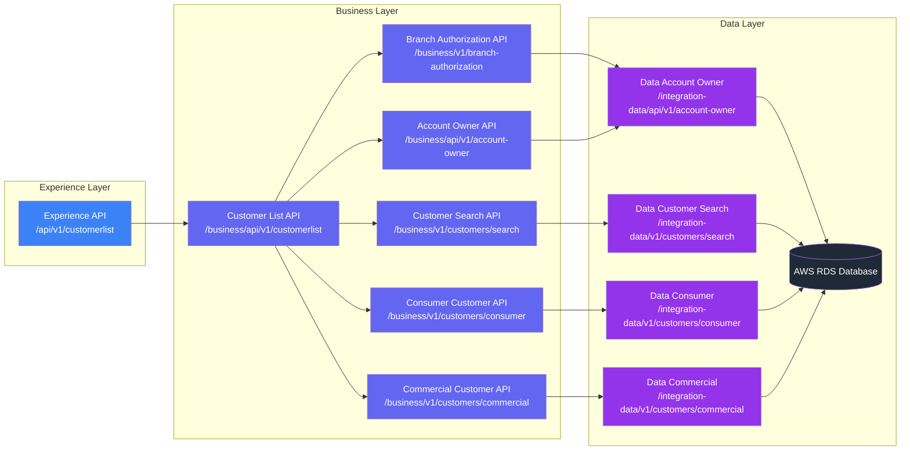
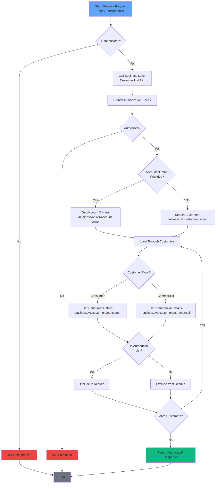

I'll update the document with the new flow structure and update all the Mermaid diagrams accordingly. Here are the key changes:

## Updated Sections:

### 2.2 Business Layer APIs

**Base Path:** `/business/api/v1/`

The business layer consists of updated core APIs with new consumer/commercial separation:

#### 2.2.1 Customer List API (New Orchestrator)
**Endpoint:** `/business/api/v1/customerlist`

Orchestrates the entire customer retrieval process including branch authorization, customer identification, and detail retrieval.

**Key Functions:**
- Call branch authorization API
- Route to account owner or customer search based on input
- Call appropriate customer detail APIs (consumer/commercial)
- Aggregate and filter results
- Handle error scenarios

#### 2.2.2 Branch Authorization API (Updated)
**Endpoint:** `/business/v1/branch-authorization`

#### 2.2.3 Get Account Owner API (Updated)
**Endpoint:** `/business/api/v1/account-owner`

#### 2.2.4 Get Customer List API (Updated)
**Endpoint:** `/business/v1/customers/search`

#### 2.2.5 Get Consumer Customer API (New)
**Endpoint:** `/business/v1/customers/consumer`

Retrieves detailed consumer customer information.

#### 2.2.6 Get Commercial Customer API (New)
**Endpoint:** `/business/v1/customers/commercial`

Retrieves detailed commercial customer information.

### 2.3 Integration/Data Layer

**Base Path:** `/integration-data/v1/`

**Updated Endpoints:**
- `/integration-data/api/v1/account-owner`
- `/integration-data/v1/customers/search`
- `/integration-data/v1/customers/consumer`
- `/integration-data/v1/customers/commercial`

## Updated API Flow and Business Logic

### 3.2 Detailed Flow Steps

#### Step 1: Client Request Processing
- Client sends GET request to `/api/v1/customerlist` with query parameters
- Experience API validates authentication token (JWT/OAuth)
- If authentication fails → Return 401 Unauthorized
- If authentication succeeds → Generate correlation ID and log request

#### Step 2: Business Layer Orchestration
- Experience API calls Business Layer: Customer List API (`/business/api/v1/customerlist`)
- Business Layer orchestrates the entire flow

#### Step 3: Branch Authorization Check
- Business Layer calls Branch Authorization API (`/business/v1/branch-authorization`)
- Pass branch code, user ID, and request type
- Branch Authorization API calls Data Layer to retrieve branch permissions
- Data Layer returns authorized customer ID list
- If not authorized → Return 403 Forbidden
- If authorized → Store authorized customer list and continue

#### Step 4: Customer Identification (Fork Based on Input)

**Path A: Account Number Provided**
- Business Layer calls Get Account Owner API (`/business/api/v1/account-owner`)
- Get Account Owner API calls Data Layer (`/integration-data/api/v1/account-owner`)
- Data Layer queries account-customer relationship table
- Returns list of customer IDs associated with the account

**Path B: Search Criteria Provided (No Account Number)**
- Business Layer calls Get Customer List API (`/business/v1/customers/search`)
- Get Customer List API calls Data Layer (`/integration-data/v1/customers/search`)
- Data Layer performs search query with fuzzy matching
- Returns list of matching customer IDs

#### Step 5: Customer Details Retrieval with Type Detection
- For each customer ID from Step 4:
  - Determine customer type (consumer/commercial)
  - Based on customer type:
    - Call Get Consumer Customer API (`/business/v1/customers/consumer`) OR
    - Call Get Commercial Customer API (`/business/v1/customers/commercial`)
  - Consumer/Commercial APIs call Data Layer:
    - `/integration-data/v1/customers/consumer` OR
    - `/integration-data/v1/customers/commercial`
  - Retrieve complete customer profile based on type
  - Store customer details in temporary collection

#### Step 6: Authorization Filtering
- For each retrieved customer:
  - Check if customer ID exists in authorized customer list from Step 3
  - If authorized → Add to final result set
  - If not authorized → Skip customer (do not include in response)

#### Step 7: Response Aggregation
- Combine all authorized customer details
- Add metadata (total count, correlation ID, timestamp)
- Transform to external API format
- Log response details (excluding PII)

#### Step 8: Return Response
- Return HTTP 200 OK with customer data array
- Include correlation ID for troubleshooting
- Client receives filtered, authorized customer list

## Updated Mermaid Diagrams

### Complete System Flow (Updated)

```mermaid
graph TB
    Start([Client Request]) --> ExpAPI[Experience API<br/>/api/v1/customerlist]
    
    ExpAPI --> BusCustomerList[Business Layer<br/>Customer List API<br/>/business/api/v1/customerlist]
    
    BusCustomerList --> BranchAuth[Business Layer<br/>Branch Authorization API<br/>/business/v1/branch-authorization]
    
    BranchAuth --> CheckAuth{Branch<br/>Authorized?}
    CheckAuth -->|No| NotAuth[Return 403<br/>Not Authorized]
    CheckAuth -->|Yes| StoreAuth[Store Authorized<br/>Customer List]
    
    StoreAuth --> AccCheck{Account Number<br/>Supplied?}
    
    AccCheck -->|Yes| GetAccOwner[Business Layer<br/>Get Account Owner API<br/>/business/api/v1/account-owner]
    GetAccOwner --> DataAccOwner[Data Layer<br/>/integration-data/api/v1/account-owner]
    DataAccOwner --> CustList1[Customer ID List]
    
    AccCheck -->|No| GetCustList[Business Layer<br/>Get Customer List API<br/>/business/v1/customers/search]
    GetCustList --> DataCustSearch[Data Layer<br/>/integration-data/v1/customers/search]
    DataCustSearch --> CustList2[Customer ID List]
    
    CustList1 --> LoopStart{For Each<br/>Customer ID}
    CustList2 --> LoopStart
    
    LoopStart --> CustTypeCheck{Customer<br/>Type?}
    
    CustTypeCheck -->|Consumer| GetConsumer[Business Layer<br/>Get Consumer API<br/>/business/v1/customers/consumer]
    GetConsumer --> DataConsumer[Data Layer<br/>/integration-data/v1/customers/consumer]
    
    CustTypeCheck -->|Commercial| GetCommercial[Business Layer<br/>Get Commercial API<br/>/business/v1/customers/commercial]
    GetCommercial --> DataCommercial[Data Layer<br/>/integration-data/v1/customers/commercial]
    
    DataConsumer --> FilterAuth{Customer in<br/>Authorized List?}
    DataCommercial --> FilterAuth
    
    FilterAuth -->|Yes| AddResult[Add to Result Set]
    FilterAuth -->|No| SkipCust[Skip Customer]
    
    AddResult --> MoreCust{More<br/>Customers?}
    SkipCust --> MoreCust
    MoreCust -->|Yes| LoopStart
    MoreCust -->|No| Aggregate[Aggregate Results]
    
    Aggregate --> LogResp[Log Response]
    LogResp --> Transform[Transform to<br/>External Format]
    Transform --> Return[Return 200 OK<br/>with Customer Data]
    
    NotAuth --> End([End])
    Return --> End
    
    style ExpAPI fill:#3b82f6,color:#fff
    style BusCustomerList fill:#6366f1,color:#fff
    style BranchAuth fill:#6366f1,color:#fff
    style GetAccOwner fill:#6366f1,color:#fff
    style GetCustList fill:#6366f1,color:#fff
    style GetConsumer fill:#6366f1,color:#fff
    style GetCommercial fill:#6366f1,color:#fff
    style DataAccOwner fill:#9333ea,color:#fff
    style DataCustSearch fill:#9333ea,color:#fff
    style DataConsumer fill:#9333ea,color:#fff
    style DataCommercial fill:#9333ea,color:#fff
    style Return fill:#10b981,color:#fff
    style NotAuth fill:#ef4444,color:#fff
```



### Layer Interaction Diagram (Updated)



### Decision Flow for Customer Retrieval (Updated)



## Updated API Specifications

### 4.1 Experience Layer API

#### GET /api/v1/customerlist

(Updated endpoint path from `/customers` to `/customerlist`)

### 4.2 Business Layer APIs

#### 4.2.1 POST /business/api/v1/customerlist (New)

Orchestrates the complete customer retrieval process.

**Request Body:**
```json
{
  "branchCode": "BR001",
  "userId": "USR123",
  "searchCriteria": {
    "accountNumber": "ACC123456",
    "customerName": "John Doe",
    "companyName": "Acme Corp",
    "customerId": "CUST001"
  }
}
```

**Response (200 OK):**
```json
{
  "customers": [
    {
      "customerType": "CONSUMER",
      "customerId": "CUST001",
      "personalInfo": {
        "name": "John Doe",
        "email": "john.doe@example.com"
      },
      "address": {
        "street": "123 Main Street",
        "city": "Springfield"
      },
      "accounts": [
        {
          "accountNumber": "ACC123456",
          "accountType": "SAVINGS"
        }
      ]
    }
  ],
  "totalCount": 1,
  "authorizedCount": 1,
  "correlationId": "550e8400-e29b-41d4-a716-446655440000"
}
```

#### 4.2.6 GET /business/v1/customers/consumer (New)

**Response (200 OK):**
```json
{
  "customerId": "CUST001",
  "customerType": "CONSUMER",
  "personalInfo": {
    "firstName": "John",
    "lastName": "Doe",
    "dateOfBirth": "1980-01-15",
    "ssn": "***-**-4567"
  },
  "employmentInfo": {
    "occupation": "Software Engineer",
    "employer": "Tech Company Inc",
    "annualIncome": 95000
  },
  "creditInfo": {
    "creditScore": 780,
    "creditLimit": 15000,
    "outstandingBalance": 2500
  }
}
```

#### 4.2.7 GET /business/v1/customers/commercial (New)

**Response (200 OK):**
```json
{
  "customerId": "CUST002",
  "customerType": "COMMERCIAL",
  "businessInfo": {
    "legalName": "Acme Corporation",
    "dbaName": "Acme Corp",
    "taxId": "**-***-4567",
    "businessType": "CORPORATION",
    "industry": "MANUFACTURING",
    "foundingDate": "2010-05-15"
  },
  "financialInfo": {
    "annualRevenue": 5000000,
    "numberOfEmployees": 45,
    "businessCreditScore": 85
  },
  "owners": [
    {
      "ownerId": "OWN001",
      "name": "John Doe",
      "ownershipPercentage": 60
    }
  ]
}
```

These updates reflect the new flow structure with proper separation between consumer and commercial customer data retrieval while maintaining the layered architecture and branch authorization patterns.
