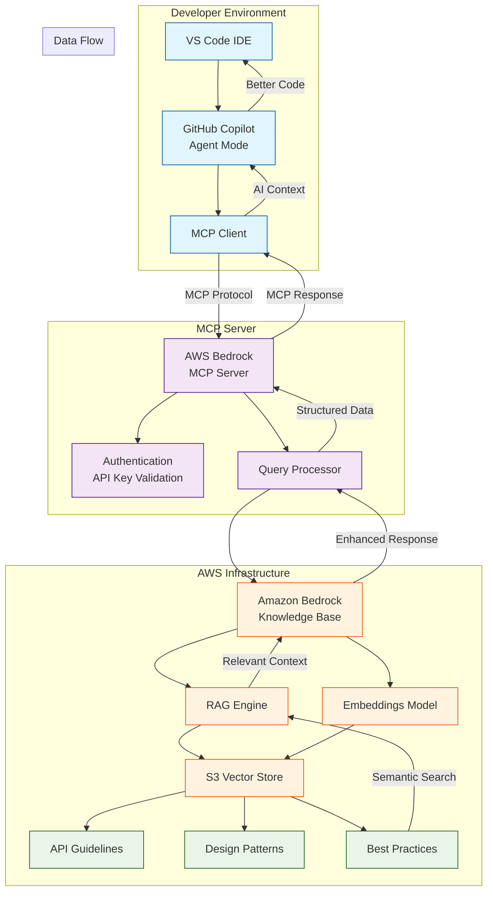

Here's a more detailed but still clean Mermaid architecture diagram:

**Key Components & Flow:**

### 👨‍💻 **Developer Environment**
- **VS Code IDE**: Where development happens
- **GitHub Copilot**: In agent mode, acting as AI assistant
- **MCP Client**: Built into Copilot, handles protocol communication

### 🔌 **MCP Server Layer**
- **AWS Bedrock MCP Server**: Custom server that bridges MCP and AWS services
- **Authentication**: Validates API keys or OAuth tokens
- **Query Processor**: Handles incoming requests and formats responses

### ☁️ **AWS Infrastructure**
- **Bedrock Knowledge Base**: Managed RAG service
- **RAG Engine**: Performs semantic search across documents
- **Embeddings Model**: Converts text to vectors (Amazon Titan)
- **S3 Vector Store**: Contains vectorized institutional knowledge
  - API guidelines, design patterns, and best practices

### 📡 **Data Flow Process**
1. **Query**: Developer asks Copilot to generate API code
2. **MCP Call**: Copilot sends query through MCP client to server
3. **Authentication**: Server validates the request
4. **Semantic Search**: Bedrock searches S3 vector store for relevant context
5. **Context Retrieval**: Most relevant guidelines/patterns returned
6. **Enhanced Response**: Context sent back to Copilot
7. **Better Code**: Copilot generates code following institutional standards

**Authentication Methods:**
- API Keys (simple, for development)
- OAuth 2.1 (production, with identity provider)
- AWS IAM roles (for server-to-AWS communication)

This maintains clarity while showing the essential architecture and data flow between components.
