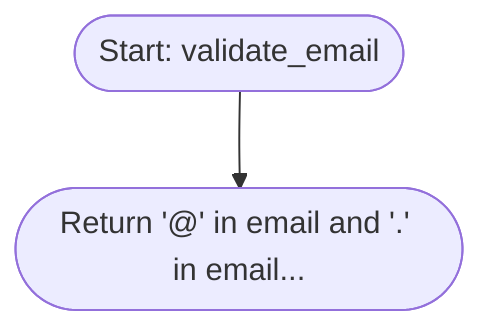

# Code Analysis Report

**Generated:** 2026-01-18 12:53:11

**Path:** `N/A`

**Language:** python

---

## Executive Summary

- **Functions:** 17
- **Classes:** 3

## Integration Points

External dependencies and system integrations:

### GET API

- **Type:** http_api
- **Location:** Line 77
- **Library:** `requests`
- **Method:** `get`

### POST API

- **Type:** http_api
- **Location:** Line 83
- **Library:** `requests`
- **Method:** `post`

## Call Graph

Function call relationships:


## Detailed Analysis

### File: `E:/LIS/test_hierarchical.py`

#### Classes

##### `UserManager` (Line 4)

Manages user operations

**Methods:** __init__, create_user, validate_email, delete_user

##### `AuthService` (Line 28)

Handles authentication

**Methods:** __init__, login, validate_credentials, generate_token, logout

##### `APIClient` (Line 63)

API client for external services

**Methods:** __init__, set_auth, get, post, _get_headers

#### Functions

##### `process_batch(items)` (Line 93)

- **Complexity:** 3
- **Documentation:** Process a batch of items

**Control Flow:**


##### `validate_item(item)` (Line 102)

- **Complexity:** 3
- **Documentation:** Validate a single item

**Control Flow:**

```mermaid
flowchart TD
    node_1([Start: validate_item])
    node_2{{If not item...}}
    node_3[1 statement(s)]
    node_4{{If 'id' not in item...}}
    node_5[1 statement(s)]
    node_6([Return True...])
    node_1 --> node_2
    node_2 -->|true| node_3
    node_3 --> node_4
    node_4 -->|true| node_5
    node_5 --> node_6
```


##### `transform_item(item)` (Line 110)

- **Complexity:** 1
- **Documentation:** Transform item data

**Control Flow:**

```mermaid
flowchart TD
    node_1([Start: transform_item])
    node_2([Return {'id': item['id'], 'processed'...])
    node_1 --> node_2
```


##### `__init__(self)` (Line 7)

- **Complexity:** 1
- **Documentation:** No documentation

**Control Flow:**


##### `create_user(self, name, email)` (Line 10)

- **Complexity:** 2
- **Documentation:** Create a new user

**Control Flow:**

```mermaid
flowchart TD
    node_1([Start: create_user])
    node_2{{If not self.validate_email(email)...}}
    node_3[1 statement(s)]
    node_4([Return user...])
    node_1 --> node_2
    node_2 -->|true| node_3
    node_3 --> node_4
```


**Business Rules:**

- **validation:** `N/A`


##### `validate_email(self, email)` (Line 19)

- **Complexity:** 1
- **Documentation:** Validate email format

**Control Flow:**




##### `delete_user(self, email)` (Line 23)

- **Complexity:** 1
- **Documentation:** Delete user by email

**Control Flow:**


##### `__init__(self)` (Line 31)

- **Complexity:** 1
- **Documentation:** No documentation

**Control Flow:**


##### `login(self, username, password)` (Line 34)

- **Complexity:** 2
- **Documentation:** Authenticate user and return token

**Control Flow:**

```mermaid
flowchart TD
    node_1([Start: login])
    node_2{{If self.validate_credentials(user...}}
    node_3[3 statement(s)]
    node_4([Return None...])
    node_1 --> node_2
    node_2 -->|true| node_3
    node_3 --> node_4
```


##### `validate_credentials(self, username, password)` (Line 42)

- **Complexity:** 3
- **Documentation:** Check if credentials are valid

**Control Flow:**

```mermaid
flowchart TD
    node_1([Start: validate_credentials])
    node_2{{If not username or not password...}}
    node_3[1 statement(s)]
    node_4{{If len(password) < 8...}}
    node_5[1 statement(s)]
    node_6([Return True...])
    node_1 --> node_2
    node_2 -->|true| node_3
    node_3 --> node_4
    node_4 -->|true| node_5
    node_5 --> node_6
```


##### `generate_token(self, username)` (Line 51)

- **Complexity:** 1
- **Documentation:** Generate authentication token

**Control Flow:**

```mermaid
flowchart TD
    node_1([Start: generate_token])
    node_2([Return hashlib.sha256(username.encode...])
    node_1 --> node_2
```


##### `logout(self, username)` (Line 56)

- **Complexity:** 2
- **Documentation:** Logout user and invalidate token

**Control Flow:**

```mermaid
flowchart TD
    node_1([Start: logout])
    node_2{{If username in self.tokens...}}
    node_3[2 statement(s)]
    node_4([Return False...])
    node_1 --> node_2
    node_2 -->|true| node_3
    node_3 --> node_4
```


##### `__init__(self, base_url)` (Line 66)

- **Complexity:** 1
- **Documentation:** No documentation

**Control Flow:**


##### `set_auth(self, token)` (Line 70)

- **Complexity:** 1
- **Documentation:** Set authentication token

**Control Flow:**


##### `get(self, endpoint)` (Line 74)

- **Complexity:** 1
- **Documentation:** Make GET request

**Control Flow:**

```mermaid
flowchart TD
    node_1([Start: get])
    node_2([Return response.json()...])
    node_1 --> node_2
```


##### `post(self, endpoint, data)` (Line 80)

- **Complexity:** 1
- **Documentation:** Make POST request

**Control Flow:**

```mermaid
flowchart TD
    node_1([Start: post])
    node_2([Return response.json()...])
    node_1 --> node_2
```


##### `_get_headers(self)` (Line 86)

- **Complexity:** 2
- **Documentation:** Build request headers

**Control Flow:**

```mermaid
flowchart TD
    node_1([Start: _get_headers])
    node_2{{If self.auth...}}
    node_3[1 statement(s)]
    node_4([Return headers...])
    node_1 --> node_2
    node_2 -->|true| node_3
    node_3 --> node_4
```


---

*Generated by Legacy Intelligence Suite - Advanced Code Analysis*
