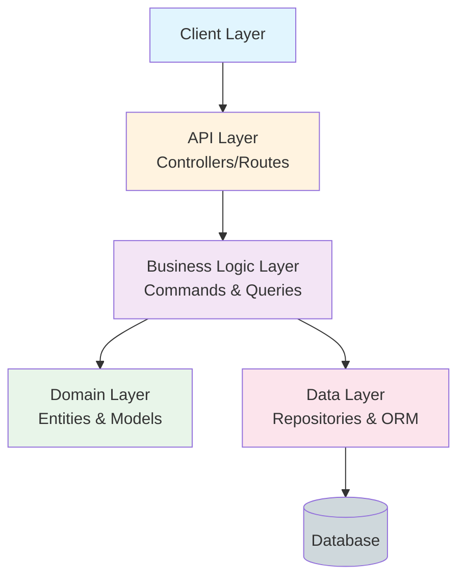
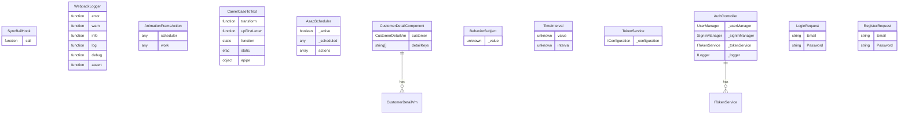

# Multi-Agent Ultra-Comprehensive Codebase Map

**Generated:** 2026-01-20 21:27:47
**Analyzer:** Multi-Agent Ultra-Comprehensive Analyzer (Language-Agnostic)

---

## Table of Contents

1. [Executive Summary](#executive-summary)
2. [Architecture Overview](#architecture-overview)
3. [Technology Stack](#technology-stack)
4. [Component Catalog](#component-catalog)
5. [API Specifications](#api-specifications)
6. [Data Models](#data-models)
7. [Business Logic](#business-logic)
8. [Development Guide](#development-guide)

---

## Executive Summary

### Key Statistics

| Metric | Value |
|--------|-------|
| **Total Files** | 550 |
| **Total Tokens** | 632,504 |
| **Total Size** | 2,076,201 bytes (2.0 MB) |
| **Languages Detected** | 3 |
| **Domain Entities** | 118 |
| **Command Handlers** | 18 |
| **Query Handlers** | 18 |
| **Validators** | 3 |
| **API Controllers** | 36 |
| **Total Endpoints** | 50 |

---

## Architecture Overview

### High-Level System Architecture



### Languages & Frameworks

**Primary Languages:**
- csharp
- javascript
- typescript


**Frameworks:**
- .NET net8.0
- Angular


**Databases:**
- SQL Server
- Redis


---

## Technology Stack

### Complete Package List


#### .NET Packages

| Package | Version |
|---------|----------|
| Microsoft.EntityFrameworkCore.InMemory | 8.0.0 |
| Microsoft.NET.Test.Sdk | 17.8.0 |
| Moq | 4.20.69 |
| Shouldly | 4.2.1 |
| xunit | 2.6.1 |
| xunit.runner.visualstudio | 2.5.3 |
| coverlet.collector | 6.0.0 |
| Microsoft.NET.Test.Sdk | 17.8.0 |
| xunit | 2.6.1 |
| xunit.runner.visualstudio | 2.5.3 |
| coverlet.collector | 6.0.0 |
| Microsoft.EntityFrameworkCore.InMemory | 8.0.0 |
| Microsoft.NET.Test.Sdk | 17.8.0 |
| Moq | 4.20.69 |
| Shouldly | 4.2.1 |
| xunit | 2.6.1 |
| xunit.runner.visualstudio | 2.5.3 |
| coverlet.collector | 6.0.0 |
| Microsoft.EntityFrameworkCore.InMemory | 8.0.0 |
| Microsoft.NET.Test.Sdk | 17.8.0 |
| xunit | 2.6.1 |
| xunit.runner.visualstudio | 2.5.3 |
| Microsoft.AspNetCore.Mvc.Testing | 8.0.0 |
| coverlet.collector | 6.0.0 |
| AutoMapper | 12.0.1 |
| AutoMapper.Extensions.Microsoft.DependencyInjection | 12.0.1 |
| FluentValidation | 11.8.1 |
| FluentValidation.DependencyInjectionExtensions | 11.8.1 |
| MediatR | 12.2.0 |
| Microsoft.EntityFrameworkCore | 8.0.0 |

#### NPM Packages

| Package | Version |
|---------|----------|
| @angular/animations | ^18.2.0 |
| @angular/cdk | ^18.2.0 |
| @angular/common | ^18.2.0 |
| @angular/compiler | ^18.2.0 |
| @angular/core | ^18.2.0 |
| @angular/forms | ^18.2.0 |
| @angular/platform-browser | ^18.2.0 |
| @angular/platform-browser-dynamic | ^18.2.0 |
| @angular/platform-server | ^18.2.0 |
| @angular/router | ^18.2.0 |
| @angular/ssr | ^18.2.0 |
| angular-feather | ^6.5.0 |
| bootstrap | ^5.3.0 |
| oidc-client-ts | ^3.3.0 |
| rxjs | ^7.8.1 |
| tslib | ^2.6.0 |
| zone.js | ^0.14.10 |

---

## Component Catalog

### Domain Entities

Total: **118**




### Entity Details

| Entity | Language | Properties | File |
|--------|----------|------------|------|
| **SyncBailHook** | unknown | 1 | `Src\WebUI\ClientApp\.angular\cache\18.2.21\babel-webpack\dfc7a7386069bcb03c6eab436370145cbe3b483a5877dc7f004de50b6ae6a829.json` |
| **WebpackLogger** | unknown | 19 | `Src\WebUI\ClientApp\.angular\cache\18.2.21\babel-webpack\dfc7a7386069bcb03c6eab436370145cbe3b483a5877dc7f004de50b6ae6a829.json` |
| **AnimationFrameAction** | unknown | 2 | `Src\WebUI\ClientApp\.angular\cache\18.2.21\babel-webpack\bdf5d127b9c5e9802126a0034c59ebad24c9a14c06c2c0d4ffb429b74d70108d.json` |
| **CamelCaseToText** | unknown | 4 | `Src\WebUI\ClientApp\.angular\cache\18.2.21\babel-webpack\005fae0beb985540531127ea06396eb1ad8dbb73a243a74d6bdd48a7038d5676.json` |
| **AsapScheduler** | unknown | 3 | `Src\WebUI\ClientApp\.angular\cache\18.2.21\babel-webpack\4240595bbd32d339c3fe03051f2c214e1ac54d16dd2577e905f51b90d02ba755.json` |
| **CustomerDetailComponent** | unknown | 2 | `Src\WebUI\ClientApp\.angular\cache\18.2.21\babel-webpack\ff5983563113e1edd985067af6275fd39334de2a378cbd4d55eb0b165176e82d.json` |
| **BehaviorSubject** | unknown | 1 | `Src\WebUI\ClientApp\.angular\cache\18.2.21\babel-webpack\f7a5b848258f3e4ce12a962a33cda064d75de78fc4e403112ea54ea27c5aad4c.json` |
| **TimeInterval** | unknown | 2 | `Src\WebUI\ClientApp\.angular\cache\18.2.21\babel-webpack\4472324ca1ea680909fa044762105899e9480bf8cc505b86ce0e1523bcd4556e.json` |
| **TokenService** | csharp | 1 | `Src\Infrastructure\Identity\TokenService.cs` |
| **AuthController** | csharp | 4 | `Src\WebUI\Controllers\AuthController.cs` |
| **LoginRequest** | csharp | 2 | `Src\WebUI\Controllers\AuthController.cs` |
| **RegisterRequest** | csharp | 2 | `Src\WebUI\Controllers\AuthController.cs` |
| **Category** | csharp | 0 | `Src\Persistence\NorthwindDbContext.cs` |
| **Customer** | csharp | 0 | `Src\Persistence\NorthwindDbContext.cs` |
| **Employee** | csharp | 0 | `Src\Persistence\NorthwindDbContext.cs` |
| **EmployeeTerritory** | csharp | 0 | `Src\Persistence\NorthwindDbContext.cs` |
| **OrderDetail** | csharp | 0 | `Src\Persistence\NorthwindDbContext.cs` |
| **Order** | csharp | 0 | `Src\Persistence\NorthwindDbContext.cs` |
| **Product** | csharp | 0 | `Src\Persistence\NorthwindDbContext.cs` |
| **Region** | csharp | 0 | `Src\Persistence\NorthwindDbContext.cs` |

### Command Handlers

Total: **18**

| Command | Language | Return Type | File |
|---------|----------|-------------|------|
| **signIn** | unknown | `Promise<IAuthenticationResult>` | `Src\WebUI\ClientApp\src\api-authorization\authorize.service.ts.backup` |
| **completeSignIn** | unknown | `Promise<IAuthenticationResult>` | `Src\WebUI\ClientApp\src\api-authorization\authorize.service.ts.backup` |
| **signOut** | unknown | `Promise<IAuthenticationResult>` | `Src\WebUI\ClientApp\src\api-authorization\authorize.service.ts.backup` |
| **completeSignOut** | unknown | `Promise<IAuthenticationResult>` | `Src\WebUI\ClientApp\src\api-authorization\authorize.service.ts.backup` |
| **UpdateCustomerCommand.Handler** | csharp | `Task` | `Src\Application\Customers\Commands\UpdateCustomer\UpdateCustomerCommand.cs` |
| **UpsertCategoryCommandHandler** | csharp | `int` | `Src\Application\Categories\Commands\UpsertCategory\UpsertCategoryCommand.cs` |
| **CreateUserAsync** | csharp | `Task<(Result Result, string UserId)>` | `Src\Infrastructure\Identity\UserManagerService.cs` |
| **DeleteUserAsync** | csharp | `Task<Result>` | `Src\Infrastructure\Identity\UserManagerService.cs` |
| **DeleteCategoryCommandHandler** | csharp | `Task` | `Src\Application\Categories\Commands\DeleteCategory\DeleteCategoryCommand.cs` |
| **DeleteCustomerCommand** | csharp | `void` | `Src\Application\Customers\Commands\DeleteCustomer\DeleteCustomerCommand.cs` |
| **UpsertEmployeeCommandHandler** | csharp | `Task<int>` | `Src\Application\Employees\Commands\UpsertEmployee\UpsertEmployeeCommand.cs` |
| **DeleteEmployeeCommandHandler** | csharp | `Task` | `Src\Application\Employees\Commands\DeleteEmployee\DeleteEmployeeCommand.cs` |
| **CreateCustomerCommand.Handler** | csharp | `Unit` | `Tests\Application.UnitTests\Customers\Commands\CreateCustomer\CreateCustomerCommandTests.cs` |
| **SeedSampleDataCommandHandler** | csharp | `Task` | `Src\Application\System\Commands\SeedSampleData\SeedSampleDataCommand.cs` |
| **DeleteProductCommand** | csharp | `void` | `Src\Application\Products\Commands\DeleteProduct\DeleteProductCommand.cs` |

### Query Handlers

Total: **18**

| Query | Language | Return Type | File |
|-------|----------|-------------|------|
| **isAuthenticated** | unknown | `Observable<boolean>` | `Src\WebUI\ClientApp\src\api-authorization\authorize.service.ts.backup` |
| **getUser** | unknown | `Observable<IUser | null>` | `Src\WebUI\ClientApp\src\api-authorization\authorize.service.ts.backup` |
| **getAccessToken** | unknown | `Observable<string>` | `Src\WebUI\ClientApp\src\api-authorization\authorize.service.ts.backup` |
| **GetEmployeesListQueryHandler** | csharp | `EmployeesListVm` | `Src\Application\Employees\Queries\GetEmployeesList\GetEmployeesListQuery.cs` |
| **GetProductsListQueryHandler** | csharp | `ProductsListVm` | `Src\Application\Products\Queries\GetProductsList\GetProductsListQueryHandler.cs` |
| **GetCustomerDetailQueryHandler** | csharp | `CustomerDetailVm` | `Src\Application\Customers\Queries\GetCustomerDetail\GetCustomerDetailQueryHandler.cs` |
| **GetCustomersListQueryHandler** | csharp | `CustomersListVm` | `Tests\Application.UnitTests\Customers\Queries\GetCustomersListQueryHandlerTests.cs` |
| **GetProductDetailQuery** | csharp | `ProductDetailVm` | `Src\Application\Products\Queries\GetProductDetail\GetProductDetailQuery.cs` |
| **GetProductsListQuery** | csharp | `ProductsListVm` | `Src\Application\Products\Queries\GetProductsList\GetProductsListQuery.cs` |
| **GetProductsFileQueryHandler** | csharp | `ProductsFileVm` | `Src\Application\Products\Queries\GetProductsFile\GetProductsFileQueryHandler.cs` |
| **GetEmployeeDetailQueryHandler** | csharp | `EmployeeDetailVm` | `Src\Application\Employees\Queries\GetEmployeeDetail\GetEmployeeDetailQuery.cs` |
| **GetCategoriesListQueryHandler** | csharp | `CategoriesListVm` | `Src\Application\Categories\Queries\GetCategoriesList\GetCategoriesListQueryHandler.cs` |
| **GetCustomersListQueryHandler** | csharp | `CustomersListVm` | `Src\Application\Customers\Queries\GetCustomersList\GetCustomersListQueryHandler.cs` |
| **GetCustomerDetailQuery** | csharp | `CustomerDetailVm` | `Src\Application\Customers\Queries\GetCustomerDetail\GetCustomerDetailQuery.cs` |
| **GetCategoriesListQuery** | csharp | `CategoriesListVm` | `Src\Application\Categories\Queries\GetCategoriesList\GetCategoriesListQuery.cs` |

### Validators

Total: **3**

| Validator | Language | Validates | File |
|-----------|----------|-----------|------|
| **DeleteCustomerCommandValidator** | csharp | `DeleteCustomerCommand` | `Src\Application\Customers\Commands\DeleteCustomer\DeleteCustomerCommandValidator.cs` |
| **GetCustomerDetailQueryValidator** | csharp | `GetCustomerDetailQuery` | `Src\Application\Customers\Queries\GetCustomerDetail\GetCustomerDetailQueryValidator.cs` |
| **CreateCustomerCommandValidator** | csharp | `CreateCustomerCommand` | `Src\Application\Customers\Commands\CreateCustomer\CreateCustomerCommandValidator.cs` |

---

## API Specifications

### API Endpoints

Total endpoints: **50**


#### Create

| Method | Route | Handler | Language |
|--------|-------|---------|----------|
| **POST** | `/api/customers/create` | NotAvailable | csharp |

#### Delete

| Method | Route | Handler | Language |
|--------|-------|---------|----------|
| **DELETE** | `/api/products/delete/{id}` | Not provided | csharp |
| **DELETE** | `/api/customers/delete/{id}` | Not provided | csharp |

#### specification

| Method | Route | Handler | Language |
|--------|-------|---------|----------|
| **GET** | `/api/Categories/GetAll` | Categories_GetAll | unknown |
| **POST** | `/api/Categories/Upsert` | Categories_Upsert | unknown |
| **DELETE** | `/api/Categories/Delete/{id}` | Categories_Delete | unknown |
| **GET** | `/api/Customers/GetAll` | Customers_GetAll | unknown |
| **GET** | `/api/Customers/Get/{id}` | Customers_Get | unknown |
| **POST** | `/api/Customers/Create` | Customers_Create | unknown |
| **PUT** | `/api/Customers/Update/{id}` | Customers_Update | unknown |
| **DELETE** | `/api/Customers/Delete/{id}` | Customers_Delete | unknown |
| **GET** | `/api/Employees/GetAll` | Employees_GetAll | unknown |
| **GET** | `/api/Employees/Get/{id}` | Employees_Get | unknown |
| **POST** | `/api/Employees/Upsert` | Employees_Upsert | unknown |
| **DELETE** | `/api/Employees/Delete/{id}` | Employees_Delete | unknown |
| **GET** | `/api/Products/GetAll` | Products_GetAll | unknown |
| **GET** | `/api/Products/Get/{id}` | Products_Get | unknown |
| **POST** | `/api/Products/Create` | Products_Create | unknown |
| **PUT** | `/api/Products/Update` | Products_Update | unknown |
| **DELETE** | `/api/Products/Delete/{id}` | Products_Delete | unknown |
| **GET** | `/api/Products/Download` | Products_Download | unknown |

#### ProductsController

| Method | Route | Handler | Language |
|--------|-------|---------|----------|
| **GET** | `/` | GetAll | csharp |
| **GET** | `/{id}` | Get | csharp |
| **POST** | `/` | Create | csharp |
| **PUT** | `/` | Update | csharp |
| **DELETE** | `/{id}` | Delete | csharp |
| **GET** | `/download` | Download | csharp |

#### EmployeesController

| Method | Route | Handler | Language |
|--------|-------|---------|----------|
| **GET** | `/` | GetAll | csharp |
| **GET** | `/{id}` | Get | csharp |
| **POST** | `/` | Upsert | csharp |
| **DELETE** | `/{id}` | Delete | csharp |

#### CategoriesController

| Method | Route | Handler | Language |
|--------|-------|---------|----------|
| **GET** | `/` | GetAll | csharp |
| **POST** | `/` | Upsert | csharp |
| **DELETE** | `/{id}` | Delete | csharp |

#### GetAll

| Method | Route | Handler | Language |
|--------|-------|---------|----------|
| **GET** | `/api/products/getall` | Not provided | csharp |
| **GET** | `/api/customers/getall` | ReturnsCustomersListViewModel | csharp |

#### northwind-traders-api

| Method | Route | Handler | Language |
|--------|-------|---------|----------|
| **GET** | `/api/Categories/GetAll` | getAll | typescript |
| **POST** | `/api/Categories/Upsert` | upsert | typescript |
| **DELETE** | `/api/Categories/Delete/{id}` | delete | typescript |
| **GET** | `/api/Customers/GetAll` | getAll | typescript |
| **GET** | `/api/Customers/Get/{id}` | get | typescript |
| **POST** | `/api/Customers/Create` | create | typescript |

#### CustomersController

| Method | Route | Handler | Language |
|--------|-------|---------|----------|
| **GET** | `/` | GetAll | csharp |
| **GET** | `/{id}` | Get | csharp |
| **POST** | `/` | Create | csharp |
| **PUT** | `/{id}` | Update | csharp |
| **DELETE** | `/{id}` | Delete | csharp |

#### GetById

| Method | Route | Handler | Language |
|--------|-------|---------|----------|
| **GET** | `/api/customers/get/{id}` | Unknown | csharp |
| **GET** | `/api/products/get/{id}` | Not specified | csharp |

---

## Data Models

### Entity Relationships


#### SyncBailHook

**Language:** unknown
**File:** `Src\WebUI\ClientApp\.angular\cache\18.2.21\babel-webpack\dfc7a7386069bcb03c6eab436370145cbe3b483a5877dc7f004de50b6ae6a829.json`

**Properties:**

- `function call`


#### WebpackLogger

**Language:** unknown
**File:** `Src\WebUI\ClientApp\.angular\cache\18.2.21\babel-webpack\dfc7a7386069bcb03c6eab436370145cbe3b483a5877dc7f004de50b6ae6a829.json`

**Properties:**

- `function error`
- `function warn`
- `function info`
- `function log`
- `function debug`
- `function assert`
- `function trace`
- `function clear`
- `function status`
- `function group`


#### AnimationFrameAction

**Language:** unknown
**File:** `Src\WebUI\ClientApp\.angular\cache\18.2.21\babel-webpack\bdf5d127b9c5e9802126a0034c59ebad24c9a14c06c2c0d4ffb429b74d70108d.json`
**Inherits From:** `AsyncAction`

**Properties:**

- `any scheduler`
- `any work`


#### CamelCaseToText

**Language:** unknown
**File:** `Src\WebUI\ClientApp\.angular\cache\18.2.21\babel-webpack\005fae0beb985540531127ea06396eb1ad8dbb73a243a74d6bdd48a7038d5676.json`

**Properties:**

- `function transform`
- `function upFirstLetter`
- `static function ɵfac`
- `static object ɵpipe`


#### AsapScheduler

**Language:** unknown
**File:** `Src\WebUI\ClientApp\.angular\cache\18.2.21\babel-webpack\4240595bbd32d339c3fe03051f2c214e1ac54d16dd2577e905f51b90d02ba755.json`
**Inherits From:** `AsyncScheduler`

**Properties:**

- `boolean _active`
- `any _scheduled`
- `array actions`


#### CustomerDetailComponent

**Language:** unknown
**File:** `Src\WebUI\ClientApp\.angular\cache\18.2.21\babel-webpack\ff5983563113e1edd985067af6275fd39334de2a378cbd4d55eb0b165176e82d.json`

**Properties:**

- `CustomerDetailVm customer`
- `string[] detailKeys`


#### BehaviorSubject

**Language:** unknown
**File:** `Src\WebUI\ClientApp\.angular\cache\18.2.21\babel-webpack\f7a5b848258f3e4ce12a962a33cda064d75de78fc4e403112ea54ea27c5aad4c.json`
**Inherits From:** `Subject`

**Properties:**

- `unknown _value`


#### TimeInterval

**Language:** unknown
**File:** `Src\WebUI\ClientApp\.angular\cache\18.2.21\babel-webpack\4472324ca1ea680909fa044762105899e9480bf8cc505b86ce0e1523bcd4556e.json`

**Properties:**

- `unknown value`
- `unknown interval`


#### TokenService

**Language:** csharp
**File:** `Src\Infrastructure\Identity\TokenService.cs`

**Properties:**

- `IConfiguration _configuration`


#### AuthController

**Language:** csharp
**File:** `Src\WebUI\Controllers\AuthController.cs`
**Inherits From:** `ControllerBase`

**Properties:**

- `UserManager<ApplicationUser> _userManager`
- `SignInManager<ApplicationUser> _signInManager`
- `ITokenService _tokenService`
- `ILogger<AuthController> _logger`


---

## Business Logic

### Architecture Patterns Detected

- **CQRS Pattern**: Command Query Responsibility Segregation detected
- **Validation Pattern**: Input validation layer detected
- **REST API Pattern**: RESTful endpoints detected


### Request Flow

1. **API Layer** receives HTTP requests
2. **Validation** checks input data
3. **Business Logic** processes commands/queries
4. **Domain Layer** applies business rules
5. **Data Layer** persists/retrieves data
6. **Response** returned to client

---

## Development Guide

### Languages & Tools Required

- **.NET SDK 8.0+** for C# development
- **Node.js 18+** with npm/yarn
- **Node.js 18+** with npm/yarn

### Getting Started

```bash
# Clone repository
git clone <repository-url>

# Install dependencies
# (command varies by language/framework)

# Run application
# (command varies by framework)

# Run tests
# (command varies by test framework)
```

### Project Structure Patterns


Common patterns detected:
- Domain/Entity layer for business logic
- API/Controller layer for HTTP endpoints
- Service layer for business operations
- Repository/Data layer for persistence

---

## Analysis Metadata

### Agent Execution

- **Agent 1**: Processed 181 files
- **Agent 2**: Processed 182 files
- **Agent 3**: Processed 187 files
- **Agent 4**: Processed 181 files
- **Agent 5**: Processed 182 files
- **Agent 6**: Processed 187 files
- **Agent 7**: Processed 181 files
- **Agent 8**: Processed 182 files
- **Agent 9**: Processed 187 files


### Statistics

- **Files Analyzed**: 550
- **Total Size**: 1.98 MB
- **Languages**: csharp, javascript, typescript
- **Skipped (large)**: 23
- **Skipped (errors)**: 0

---

**Analysis Complete** - 2026-01-20 21:27:47

*Generated by Multi-Agent Ultra-Comprehensive Analyzer*
*Language-Agnostic | Scalable | Context-Window Managed*
