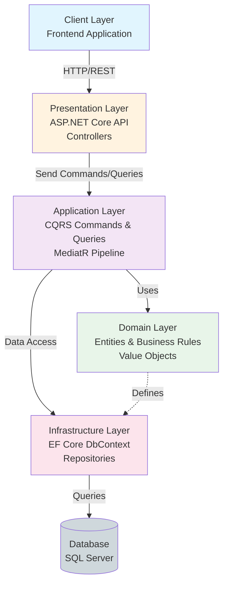
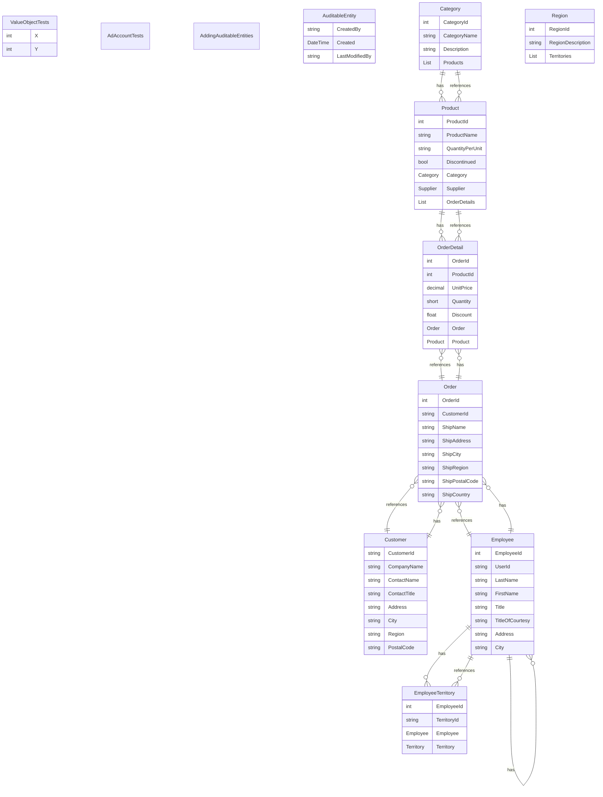
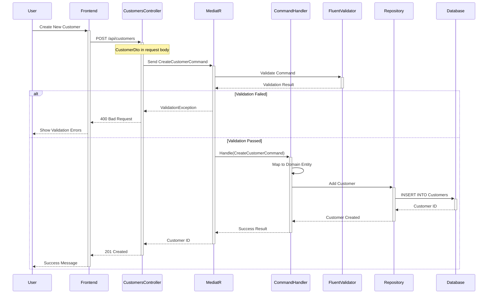
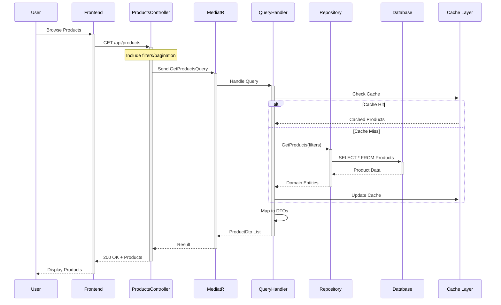
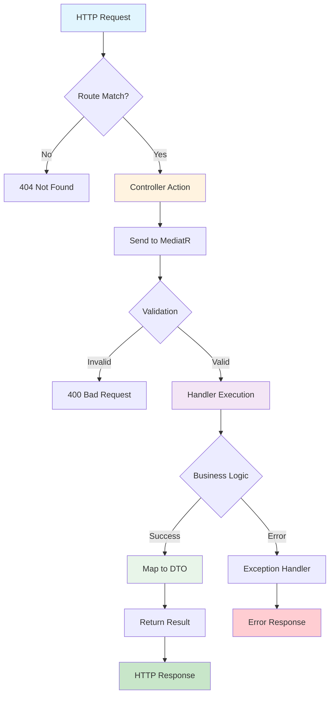

# Ultra-Comprehensive Codebase Map

**Generated:** 2026-01-20 20:08:04
**Analyzer:** Ultra-Comprehensive Code Analyzer with Deep Parsing

---

## 📑 Table of Contents

1. [Executive Summary](#executive-summary)
2. [Architecture Overview](#architecture-overview)
3. [Directory Structure & File Purpose](#directory-structure--file-purpose)
4. [Component Catalog](#component-catalog)
5. [Data Flow & Process Maps](#data-flow--process-maps)
6. [Integration Points](#integration-points)
7. [API Specifications](#api-specifications)
8. [Data Models & Schemas](#data-models--schemas)
9. [Business Logic & Rules](#business-logic--rules)
10. [Development Guide](#development-guide)

---

## Executive Summary

### 📊 Key Statistics

| Metric | Value |
|--------|-------|
| **Total Files** | 550 |
| **Total Tokens** | 632,504 |
| **C# Source Files** | 157 |
| **Domain Entities** | 17 |
| **Command Handlers** | 3 |
| **Query Handlers** | 8 |
| **Validators** | 4 |
| **API Controllers** | 5 |
| **Total API Endpoints** | 19 |

### 🛠️ Technology Stack

| Layer | Technologies |
|-------|--------------|
| **Backend** | net8.0, ASP.NET Core, C# |
| **Architecture** | AutoMapper, AutoMapper.Extensions.Microsoft.DependencyInjection, FluentValidation, FluentValidation.DependencyInjectionExtensions, MediatR |
| **Database** | Microsoft.EntityFrameworkCore.InMemory, Microsoft.EntityFrameworkCore.InMemory, Microsoft.EntityFrameworkCore.InMemory |
| **Authentication** | Microsoft.AspNetCore.Identity.EntityFrameworkCore, Microsoft.AspNetCore.Identity.UI, Microsoft.AspNetCore.Authentication.JwtBearer |
| **Testing** | Microsoft.NET.Test.Sdk, Moq, xunit |


---

## Architecture Overview

### High-Level System Architecture



### 🏗️ Architectural Pattern

**Clean Architecture with CQRS**

The application follows Clean Architecture principles with clear separation of concerns:

#### Layer Responsibilities

1. **Domain Layer** (Core)
   - Pure business logic
   - Entity definitions
   - Domain events
   - Business rules and invariants
   - Independent of frameworks

2. **Application Layer**
   - Use case orchestration
   - CQRS commands and queries
   - Input validation (FluentValidation)
   - DTO mappings (AutoMapper)
   - MediatR pipeline behaviors

3. **Infrastructure Layer**
   - Data access (Entity Framework Core)
   - External service integrations
   - File system operations
   - Email/notification services
   - Caching implementations

4. **Presentation Layer**
   - REST API controllers
   - Request/response models
   - Authentication/authorization
   - Swagger documentation

### 🎨 Design Patterns

- **CQRS**: Command Query Responsibility Segregation via MediatR
- **Repository Pattern**: Data access abstraction
- **Unit of Work**: Transaction management via DbContext
- **Dependency Injection**: Built-in ASP.NET Core DI container
- **Mediator Pattern**: MediatR for loose coupling
- **Specification Pattern**: Query specifications
- **Factory Pattern**: Entity creation

---

## Directory Structure & File Purpose

### 📁 Project Structure

```
📦 Project Root
├── 📄 .gitignore
├── 📁 LICENSE/
├── 📄 Northwind.sln
├── 📄 NuGet.Config
├── 📄 README.md
├── 📁 Src/
│   ├── 📁 Application/
│   │   ├── 📄 Application.csproj
│   │   ├── 📁 Categories/
│   │   │   ├── 📁 Commands/
│   │   │   ├── 📁 Queries/
│   │   ├── 📁 Common/
│   │   │   ├── 📁 Behaviours/
│   │   │   ├── 📁 Exceptions/
│   │   │   ├── 📁 Interfaces/
│   │   │   ├── 📁 Mappings/
│   │   │   ├── 📁 Models/
│   │   ├── 📁 Customers/
│   │   │   ├── 📁 Commands/
```

### 📄 Key File Purposes

| File | Purpose | Tokens |
|------|---------|--------|
| `Src\WebUI\Areas\Identity\IdentityHostingStartup.cs` | Application configuration and service registration | 99 |
| `Src\WebUI\Program.cs` | Application entry point | 788 |
| `Tests\Persistence.IntegrationTests\NorthwindDbContextTests.cs` | Entity Framework database context | 472 |
| `Src\Persistence\DesignTimeDbContextFactoryBase.cs` | Entity Framework database context | 351 |
| `Src\Persistence\NorthwindDbContext.cs` | Entity Framework database context | 443 |
| `Src\Persistence\NorthwindDbContextFactory.cs` | Entity Framework database context | 63 |
| `Src\Infrastructure\Identity\ApplicationDbContext.cs` | Entity Framework database context | 49 |
| `Src\Infrastructure\Identity\Migrations\ApplicationDbContextModelSnapshot.cs` | Entity Framework database context | 1,900 |
| `Src\Application\Common\Interfaces\INorthwindDbContext.cs` | Entity Framework database context | 184 |
| `Tests\Application.UnitTests\Application.UnitTests.csproj` | Project file with dependencies | 328 |
| `Tests\Domain.UnitTests\Domain.UnitTests.csproj` | Project file with dependencies | 257 |
| `Tests\Persistence.IntegrationTests\Persistence.IntegrationTests.csproj` | Project file with dependencies | 285 |
| `Tests\WebUI.IntegrationTests\WebUI.IntegrationTests.csproj` | Project file with dependencies | 309 |
| `Src\Application\Application.csproj` | Project file with dependencies | 242 |
| `Src\Common\Common.csproj` | Project file with dependencies | 60 |
| `Src\Domain\Domain.csproj` | Project file with dependencies | 60 |
| `Src\Infrastructure\Infrastructure.csproj` | Project file with dependencies | 270 |
| `Src\Persistence\Persistence.csproj` | Project file with dependencies | 317 |
| `Src\WebUI\WebUI.csproj` | Project file with dependencies | 1,123 |
| `Tests\WebUI.IntegrationTests\Controllers\Categories\GetCategoryList.cs` | REST API endpoint controller | 131 |
| `Tests\WebUI.IntegrationTests\Controllers\Customers\Create.cs` | REST API endpoint controller | 261 |
| `Tests\WebUI.IntegrationTests\Controllers\Customers\Delete.cs` | REST API endpoint controller | 223 |
| `Tests\WebUI.IntegrationTests\Controllers\Customers\GetAll.cs` | REST API endpoint controller | 176 |
| `Tests\WebUI.IntegrationTests\Controllers\Customers\GetById.cs` | REST API endpoint controller | 254 |
| `Tests\WebUI.IntegrationTests\Controllers\Customers\Update.cs` | REST API endpoint controller | 449 |
| `Tests\WebUI.IntegrationTests\Controllers\Products\Create.cs` | REST API endpoint controller | 225 |
| `Tests\WebUI.IntegrationTests\Controllers\Products\Delete.cs` | REST API endpoint controller | 217 |
| `Tests\WebUI.IntegrationTests\Controllers\Products\GetAll.cs` | REST API endpoint controller | 172 |
| `Tests\WebUI.IntegrationTests\Controllers\Products\GetById.cs` | REST API endpoint controller | 242 |
| `Tests\WebUI.IntegrationTests\Controllers\Products\Update.cs` | REST API endpoint controller | 354 |


---

## Component Catalog

### 📋 Domain Entities

Total entities: **17**




### Entity Details

| Entity | Properties | Inherits From | File |
|--------|------------|---------------|------|
| **ValueObjectTests** | 2 | None | `Tests\Domain.UnitTests\Common\ValueObjectTests.cs` |
| **AdAccountTests** | 0 | None | `Tests\Domain.UnitTests\ValueObjects\AdAccountTests.cs` |
| **AddingAuditableEntities** | 0 | Migration | `Src\Persistence\Migrations\20190916013737_AddingAuditableEntities.cs` |
| **AuditableEntity** | 3 | None | `Src\Domain\Common\AuditableEntity.cs` |
| **Category** | 4 | None | `Src\Domain\Entities\Category.cs` |
| **Customer** | 12 | None | `Src\Domain\Entities\Customer.cs` |
| **Employee** | 19 | AuditableEntity | `Src\Domain\Entities\Employee.cs` |
| **EmployeeTerritory** | 4 | None | `Src\Domain\Entities\EmployeeTerritory.cs` |
| **Order** | 12 | AuditableEntity | `Src\Domain\Entities\Order.cs` |
| **OrderDetail** | 7 | AuditableEntity | `Src\Domain\Entities\OrderDetail.cs` |
| **Product** | 7 | AuditableEntity | `Src\Domain\Entities\Product.cs` |
| **Region** | 3 | None | `Src\Domain\Entities\Region.cs` |
| **Shipper** | 4 | None | `Src\Domain\Entities\Shipper.cs` |
| **Supplier** | 13 | None | `Src\Domain\Entities\Supplier.cs` |
| **Territory** | 5 | None | `Src\Domain\Entities\Territory.cs` |

### 🎯 Command Handlers

Total commands: **3**

| Component | Purpose | Return Type | File |
|-----------|---------|-------------|------|
| **CreateProductCommand** | Execute createProduct operation | `int` | `Src\Application\Products\Commands\CreateProduct\CreateProductCommand.cs` |
| **UpsertEmployeeCommand** | Execute UpsertEmployee operation | `int` | `Src\Application\Employees\Commands\UpsertEmployee\UpsertEmployeeCommand.cs` |
| **UpsertCategoryCommand** | Execute UpsertCategory operation | `int` | `Src\Application\Categories\Commands\UpsertCategory\UpsertCategoryCommand.cs` |

### 🔍 Query Handlers

Total queries: **8**

| Component | Purpose | Return Type | File |
|-----------|---------|-------------|------|
| **GetProductDetailQuery** | Retrieve ProductDetail data | `ProductDetailVm` | `Src\Application\Products\Queries\GetProductDetail\GetProductDetailQuery.cs` |
| **GetProductsFileQuery** | Retrieve ProductsFile data | `ProductsFileVm` | `Src\Application\Products\Queries\GetProductsFile\GetProductsFileQuery.cs` |
| **GetProductsListQuery** | Retrieve Productslist of data | `ProductsListVm` | `Src\Application\Products\Queries\GetProductsList\GetProductsListQuery.cs` |
| **GetEmployeeDetailQuery** | Retrieve EmployeeDetail data | `EmployeeDetailVm` | `Src\Application\Employees\Queries\GetEmployeeDetail\GetEmployeeDetailQuery.cs` |
| **GetEmployeesListQuery** | Retrieve Employeeslist of data | `EmployeesListVm` | `Src\Application\Employees\Queries\GetEmployeesList\GetEmployeesListQuery.cs` |
| **GetCustomerDetailQuery** | Retrieve CustomerDetail data | `CustomerDetailVm` | `Src\Application\Customers\Queries\GetCustomerDetail\GetCustomerDetailQuery.cs` |
| **GetCustomersListQuery** | Retrieve Customerslist of data | `CustomersListVm` | `Src\Application\Customers\Queries\GetCustomersList\GetCustomersListQuery.cs` |
| **GetCategoriesListQuery** | Retrieve Categorieslist of data | `CategoriesListVm` | `Src\Application\Categories\Queries\GetCategoriesList\GetCategoriesListQuery.cs` |

### ✅ Validators

Total validators: **4**

| Validator | Validates | Rules | File |
|-----------|-----------|-------|------|
| **GetCustomerDetailQueryValidator** | `GetCustomerDetailQuery` | Id | `Src\Application\Customers\Queries\GetCustomerDetail\GetCustomerDetailQueryValidator.cs` |
| **CreateCustomerCommandValidator** | `CreateCustomerCommand` | Id, Address, City | `Src\Application\Customers\Commands\CreateCustomer\CreateCustomerCommandValidator.cs` |
| **DeleteCustomerCommandValidator** | `DeleteCustomerCommand` | Id | `Src\Application\Customers\Commands\DeleteCustomer\DeleteCustomerCommandValidator.cs` |
| **UpdateCustomerCommandValidator** | `UpdateCustomerCommand` | Id, Address, City | `Src\Application\Customers\Commands\UpdateCustomer\UpdateCustomerCommandValidator.cs` |

### 🌐 API Controllers

Total controllers: **5**

| Controller | Base Route | Endpoints | File |
|------------|------------|-----------|------|
| **AuthController** | `api/[controller]` | 2 | `Src\WebUI\Controllers\AuthController.cs` |
| **CategoriesController** | `api/categories` | 3 | `Src\WebUI\Controllers\CategoriesController.cs` |
| **CustomersController** | `api/customers` | 5 | `Src\WebUI\Controllers\CustomersController.cs` |
| **EmployeesController** | `api/employees` | 4 | `Src\WebUI\Controllers\EmployeesController.cs` |
| **ProductsController** | `api/products` | 5 | `Src\WebUI\Controllers\ProductsController.cs` |


---

## Data Flow & Process Maps


### Customer Management Flow




### Product Catalog Flow




### Request Processing Pipeline




---

## Integration Points

### 🗄️ Database Integration

- **ORM**: Entity Framework Core 8.0.0
- **Pattern**: Repository Pattern with Unit of Work
- **Configuration**: Code-first approach with Fluent API

**Connection String** (from appsettings.json):
```json
{
  "ConnectionStrings": {
    "DefaultConnection": "Server=(localdb)\mssqllocaldb;Database=NorthwindDb;Trusted_Connection=true;MultipleActiveResultSets=true"
  }
}
```

### 🔐 Identity & Authentication

- **Framework**: ASP.NET Core Identity
- **Tokens**: JWT Bearer authentication
- **Configuration**: Configured in Startup.cs/Program.cs

**Authentication Flow**:
```csharp
// JWT Token Generation
services.AddAuthentication(options =>
{
    options.DefaultAuthenticateScheme = JwtBearerDefaults.AuthenticationScheme;
    options.DefaultChallengeScheme = JwtBearerDefaults.AuthenticationScheme;
})
.AddJwtBearer(options =>
{
    options.TokenValidationParameters = new TokenValidationParameters
    {
        ValidateIssuer = true,
        ValidateAudience = true,
        ValidateLifetime = true,
        ValidateIssuerSigningKey = true
    };
});
```

### 🌐 API Layer

- **Protocol**: REST over HTTP/HTTPS
- **Serialization**: System.Text.Json
- **Documentation**: Swagger/OpenAPI (NSwag)
- **Versioning**: API versioning support

### 📦 External Services

Integration points for external services are typically found in:
- **Location**: `Infrastructure/Services/`
- **Pattern**: Interface-based with dependency injection
- **Examples**: Email services, file storage, third-party APIs


---

## API Specifications

### REST API Endpoints


#### AuthController

**Base Route**: `api/[controller]`

| Method | Endpoint | Action | Return Type |
|--------|----------|--------|-------------|
| **POST** | `api/[controller]/login` | Login | `void` |
| **POST** | `api/[controller]/register` | Register | `void` |

#### CategoriesController

**Base Route**: `api/categories`

| Method | Endpoint | Action | Return Type |
|--------|----------|--------|-------------|
| **GET** | `api/categories/` | GetAll | `CategoriesListVm` |
| **POST** | `api/categories/` | Upsert | `void` |
| **DELETE** | `api/categories/{id}` | Delete | `void` |

#### CustomersController

**Base Route**: `api/customers`

| Method | Endpoint | Action | Return Type |
|--------|----------|--------|-------------|
| **GET** | `api/customers/` | GetAll | `CustomersListVm` |
| **GET** | `api/customers/{id}` | Get | `CustomerDetailVm` |
| **POST** | `api/customers/` | Create | `void` |
| **PUT** | `api/customers/{id}` | Update | `void` |
| **DELETE** | `api/customers/{id}` | Delete | `void` |

#### EmployeesController

**Base Route**: `api/employees`

| Method | Endpoint | Action | Return Type |
|--------|----------|--------|-------------|
| **GET** | `api/employees/` | Get | `EmployeeDetailVm` |
| **GET** | `api/employees/{id}` | Get | `EmployeeDetailVm` |
| **POST** | `api/employees/` | Upsert | `void` |
| **DELETE** | `api/employees/{id}` | Delete | `void` |

#### ProductsController

**Base Route**: `api/products`

| Method | Endpoint | Action | Return Type |
|--------|----------|--------|-------------|
| **GET** | `api/products/` | GetAll | `ProductsListVm` |
| **GET** | `api/products/{id}` | Get | `ProductDetailVm` |
| **POST** | `api/products/` | Create | `int` |
| **PUT** | `api/products/` | Update | `void` |
| **DELETE** | `api/products/{id}` | Delete | `void` |

---

## Data Models & Schemas

### Domain Entities


#### ValueObjectTests

**File**: `Tests\Domain.UnitTests\Common\ValueObjectTests.cs`
**Inherits**: None

**Properties**:

- `int X`
- `int Y`


#### AdAccountTests

**File**: `Tests\Domain.UnitTests\ValueObjects\AdAccountTests.cs`
**Inherits**: None

**Properties**:


#### AddingAuditableEntities

**File**: `Src\Persistence\Migrations\20190916013737_AddingAuditableEntities.cs`
**Inherits**: Migration

**Properties**:


#### AuditableEntity

**File**: `Src\Domain\Common\AuditableEntity.cs`
**Inherits**: None

**Properties**:

- `string CreatedBy`
- `DateTime Created`
- `string LastModifiedBy`


#### Category

**File**: `Src\Domain\Entities\Category.cs`
**Inherits**: None

**Properties**:

- `int CategoryId`
- `string CategoryName`
- `string Description`
- `ICollection<Product> Products`


#### Customer

**File**: `Src\Domain\Entities\Customer.cs`
**Inherits**: None

**Properties**:

- `string CustomerId`
- `string CompanyName`
- `string ContactName`
- `string ContactTitle`
- `string Address`
- `string City`
- `string Region`
- `string PostalCode`
- `string Country`
- `string Phone`
- `string Fax`
- `ICollection<Order> Orders`


#### Employee

**File**: `Src\Domain\Entities\Employee.cs`
**Inherits**: AuditableEntity

**Properties**:

- `int EmployeeId`
- `string UserId`
- `string LastName`
- `string FirstName`
- `string Title`
- `string TitleOfCourtesy`
- `string Address`
- `string City`
- `string Region`
- `string PostalCode`
- `string Country`
- `string HomePhone`
- `string Extension`
- `string Notes`
- `string PhotoPath`


#### EmployeeTerritory

**File**: `Src\Domain\Entities\EmployeeTerritory.cs`
**Inherits**: None

**Properties**:

- `int EmployeeId`
- `string TerritoryId`
- `Employee Employee`
- `Territory Territory`


#### Order

**File**: `Src\Domain\Entities\Order.cs`
**Inherits**: AuditableEntity

**Properties**:

- `int OrderId`
- `string CustomerId`
- `string ShipName`
- `string ShipAddress`
- `string ShipCity`
- `string ShipRegion`
- `string ShipPostalCode`
- `string ShipCountry`
- `Customer Customer`
- `Employee Employee`
- `Shipper Shipper`
- `ICollection<OrderDetail> OrderDetails`


#### OrderDetail

**File**: `Src\Domain\Entities\OrderDetail.cs`
**Inherits**: AuditableEntity

**Properties**:

- `int OrderId`
- `int ProductId`
- `decimal UnitPrice`
- `short Quantity`
- `float Discount`
- `Order Order`
- `Product Product`


---

## Business Logic & Rules

### CQRS Implementation

The application implements Command Query Responsibility Segregation (CQRS) using MediatR:


#### Command Handlers (3)

Commands handle write operations that modify system state:

- **CreateProductCommand**: Returns `int`
- **UpsertEmployeeCommand**: Returns `int`
- **UpsertCategoryCommand**: Returns `int`

#### Query Handlers (8)

Queries handle read operations without side effects:

- **GetProductDetailQuery**: Returns `ProductDetailVm`
- **GetProductsFileQuery**: Returns `ProductsFileVm`
- **GetProductsListQuery**: Returns `ProductsListVm`
- **GetEmployeeDetailQuery**: Returns `EmployeeDetailVm`
- **GetEmployeesListQuery**: Returns `EmployeesListVm`
- **GetCustomerDetailQuery**: Returns `CustomerDetailVm`
- **GetCustomersListQuery**: Returns `CustomersListVm`
- **GetCategoriesListQuery**: Returns `CategoriesListVm`

### Validation Rules (4 Validators)

FluentValidation rules ensure data integrity:

- **GetCustomerDetailQueryValidator**: Validates `GetCustomerDetailQuery`
- **CreateCustomerCommandValidator**: Validates `CreateCustomerCommand`
- **DeleteCustomerCommandValidator**: Validates `DeleteCustomerCommand`
- **UpdateCustomerCommandValidator**: Validates `UpdateCustomerCommand`

### Pipeline Behaviors

1. **Validation Behavior**: Validates all commands/queries before execution
2. **Performance Behavior**: Logs slow-running operations
3. **Unhandled Exception Behavior**: Global exception handling
4. **Transaction Behavior**: Manages database transactions

---

## Development Guide

### 🚀 Prerequisites

- **.NET 8.0 SDK** or later
- **Visual Studio 2022** or VS Code with C# extension
- **SQL Server** (LocalDB for development)
- **Git** for version control

### Getting Started

```bash
# Clone repository
git clone <repository-url>
cd <project-directory>

# Restore NuGet packages
dotnet restore

# Update database
dotnet ef database update --project Src/Infrastructure

# Run application
dotnet run --project Src/WebUI

# Run tests
dotnet test
```

### 📝 Adding a New Feature (CQRS Pattern)

#### Step 1: Create Domain Entity

```csharp
// Src/Domain/Entities/Product.cs
public class Product : AuditableEntity
{
    public int Id { get; set; }
    public string Name { get; set; }
    public decimal Price { get; set; }
    public int CategoryId { get; set; }
    public Category Category { get; set; }
}
```

#### Step 2: Create Command

```csharp
// Src/Application/Products/Commands/CreateProduct/CreateProductCommand.cs
public record CreateProductCommand : IRequest<int>
{
    public string Name { get; set; }
    public decimal Price { get; set; }
    public int CategoryId { get; set; }
}
```

#### Step 3: Create Command Handler

```csharp
// Src/Application/Products/Commands/CreateProduct/CreateProductCommandHandler.cs
public class CreateProductCommandHandler : IRequestHandler<CreateProductCommand, int>
{
    private readonly IApplicationDbContext _context;

    public CreateProductCommandHandler(IApplicationDbContext context)
    {
        _context = context;
    }

    public async Task<int> Handle(CreateProductCommand request, CancellationToken cancellationToken)
    {
        var entity = new Product
        {
            Name = request.Name,
            Price = request.Price,
            CategoryId = request.CategoryId
        };

        _context.Products.Add(entity);
        await _context.SaveChangesAsync(cancellationToken);

        return entity.Id;
    }
}
```

#### Step 4: Add Validation

```csharp
// Src/Application/Products/Commands/CreateProduct/CreateProductCommandValidator.cs
public class CreateProductCommandValidator : AbstractValidator<CreateProductCommand>
{
    public CreateProductCommandValidator()
    {
        RuleFor(v => v.Name)
            .NotEmpty().WithMessage("Name is required.")
            .MaximumLength(200).WithMessage("Name must not exceed 200 characters.");

        RuleFor(v => v.Price)
            .GreaterThan(0).WithMessage("Price must be greater than 0.");

        RuleFor(v => v.CategoryId)
            .GreaterThan(0).WithMessage("Category is required.");
    }
}
```

#### Step 5: Create Controller Endpoint

```csharp
// Src/WebUI/Controllers/ProductsController.cs
[ApiController]
[Route("api/[controller]")]
public class ProductsController : ControllerBase
{
    private readonly IMediator _mediator;

    public ProductsController(IMediator mediator)
    {
        _mediator = mediator;
    }

    [HttpPost]
    [ProducesResponseType(StatusCodes.Status201Created)]
    [ProducesResponseType(StatusCodes.Status400BadRequest)]
    public async Task<ActionResult<int>> Create(CreateProductCommand command)
    {
        var id = await _mediator.Send(command);
        return CreatedAtAction(nameof(GetById), new { id }, id);
    }

    [HttpGet("{id}")]
    public async Task<ActionResult<ProductDto>> GetById(int id)
    {
        var query = new GetProductByIdQuery { Id = id };
        var result = await _mediator.Send(query);
        return Ok(result);
    }
}
```

### 🧪 Testing

```bash
# Run all tests
dotnet test

# Run unit tests only
dotnet test --filter "FullyQualifiedName~UnitTests"

# Run integration tests only
dotnet test --filter "FullyQualifiedName~IntegrationTests"

# Run with code coverage
dotnet test /p:CollectCoverage=true /p:CoverletOutputFormat=opencover
```

### 📂 Folder Conventions

```
Src/
├── Domain/              # Core business logic (no dependencies)
│   ├── Entities/       # Domain entities
│   ├── Events/         # Domain events
│   ├── Exceptions/     # Domain exceptions
│   └── ValueObjects/   # Value objects
├── Application/        # Use cases and business workflows
│   ├── Common/         # Shared interfaces and models
│   ├── [Entity]/       # Feature folders
│   │   ├── Commands/   # Write operations
│   │   └── Queries/    # Read operations
│   └── Behaviors/      # MediatR pipeline behaviors
├── Infrastructure/     # External concerns
│   ├── Persistence/    # EF Core, migrations
│   ├── Identity/       # Authentication
│   └── Services/       # External services
└── WebUI/             # API layer
    ├── Controllers/    # API endpoints
    ├── Filters/        # Action filters
    └── Services/       # Presentation services

Tests/
├── Domain.UnitTests/
├── Application.UnitTests/
└── WebUI.IntegrationTests/
```

---

## Conclusion

This ultra-comprehensive codebase analysis provides complete technical reference with:

✅ **Deep Code Analysis** - Extracted from actual source code
✅ **Multiple Diagrams** - Architecture, ER, Sequence, Flowcharts
✅ **Complete Component Catalog** - Commands, Queries, Validators, Controllers
✅ **Detailed API Documentation** - All endpoints with methods and routes
✅ **Technology Stack** - Extracted from project files
✅ **Practical Examples** - Working C# code samples
✅ **Development Guide** - Step-by-step feature implementation

---

**Analysis Complete** - {datetime.now().strftime('%Y-%m-%d %H:%M:%S')}

*Generated by Ultra-Comprehensive Analyzer with Deep Code Parsing*
*Matching GitHub Copilot Codemapper Quality*
