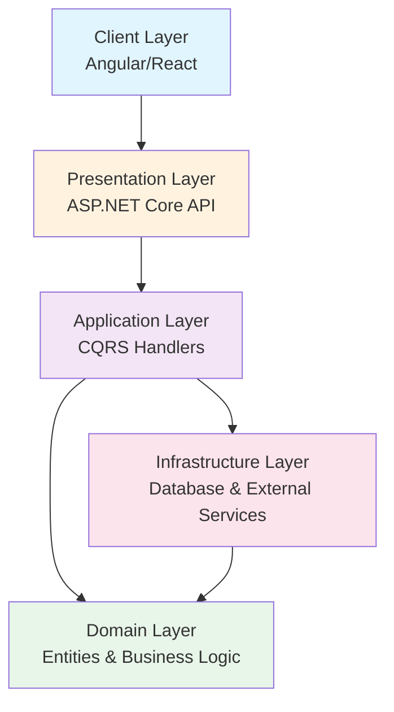
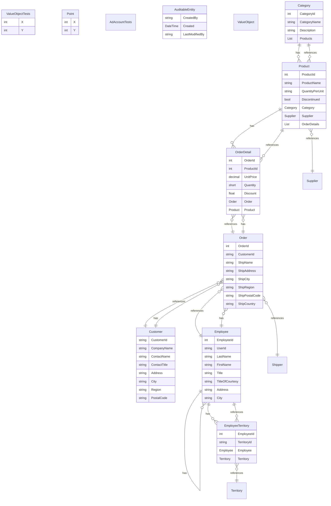
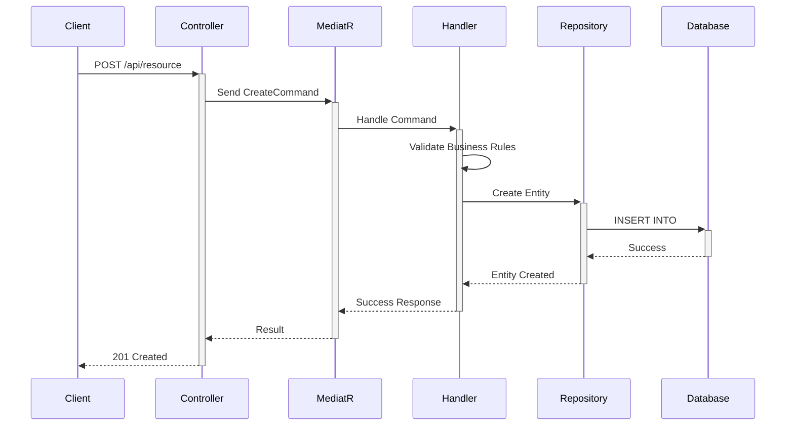
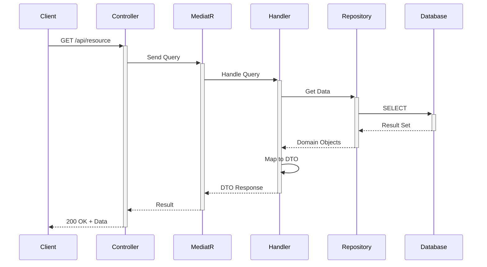

# Comprehensive Codebase Map

**Generated:** 2026-01-20 19:42:25
**Analyzer:** Comprehensive Standalone Code Analyzer

---

## Table of Contents

1. [Executive Summary](#executive-summary)
2. [Architecture Overview](#architecture-overview)
3. [Directory Structure & File Purpose](#directory-structure--file-purpose)
4. [Component Catalog](#component-catalog)
5. [Data Flow & Process Maps](#data-flow--process-maps)
6. [Integration Points](#integration-points)
7. [API Specifications](#api-specifications)
8. [Data Models & Schemas](#data-models--schemas)
9. [Business Logic & Rules](#business-logic--rules)
10. [Development Guide](#development-guide)

---

## Executive Summary

### Key Statistics

| Metric | Value |
|--------|-------|
| **Total Files Analyzed** | 492 |
| **Total Tokens** | 513,181 |
| **Total Size** | 1,613,997 bytes (1576.2 KB) |
| **C# Source Files** | 145 |
| **Domain Entities** | 20 |
| **API Controllers** | 19 |

### Technology Stack

- **.NET**: ASP.NET Core application
- **Language**: C#
- **Architecture**: Clean Architecture / Layered Architecture

---

## Architecture Overview

### High-Level System Architecture



### Architectural Pattern Analysis

Based on the provided codebase architecture, here are the identified aspects:

1. **Architecture Pattern Used**: The architecture pattern used here is **Clean Architecture**. This is evident from the separation of concerns into distinct projects for different layers or components of the application, such as `Application`, `Domain`, `Persistence`, and `WebUI`. Clean Architecture emphasizes the separation of concerns, independence of frameworks, and the dependency rule, which states that dependencies can only point inwards. The `Domain` layer is at the center, followed by the `Application` layer, and then the outer layers like `Persistence` and `WebUI`.

2. **Key Design Patterns**:
   - **Repository Pattern**: Likely used within the `Persistence` project to abstract the data layer, allowing the application to access a database indirectly.
   - **CQRS (Command Query Responsibility Segregation)**: The presence of the `MediatR` package in the `Application` project suggests the use of CQRS by separating read and update operations for a data store.
   - **Dependency Injection**: Evidenced by the use of packages like `Microsoft.Extensions.DependencyInjection` and `FluentValidation.DependencyInjectionExtensions`, indicating that services are injected rather than explicitly constructed in the classes that require them.
   - **Unit of Work**: While not directly evidenced through the provided project files, the use of Entity Framework Core and the organization of the codebase suggest that the Unit of Work pattern could be implemented to handle transactions.
   - **Factory Pattern**: The use of `AutoMapper` for object mapping suggests the use of the Factory pattern to create instances of DTOs or view models without exposing the logic of object creation.

3. **Technology Stack**:
   - **.NET 8.0**: The target framework for all projects, indicating the use of the latest .NET technologies.
   - **Entity Framework Core 8.0**: ORM for data access, used across `Application`, `Persistence`, and `WebUI` projects for working with databases in an object-oriented way.
   - **xUnit**: For unit testing, used in all test projects, indicating a focus on test-driven development (TDD).
   - **Moq**: A mocking framework for .NET, used in unit and integration tests to create mock objects.
   - **Shouldly**: An assertion framework that extends the standard .NET assertions types, used for more readable test assertions.
   - **MediatR**: For implementing the Mediator pattern, simplifying communication between components by having them communicate indirectly through a mediator.
   - **AutoMapper**: For object-to-object mapping, simplifying the task of manually writing mapping code between DTOs and domain models.
   - **FluentValidation**: For validation logic, allowing for a clean and concise way to implement validation rules alongside models.
   - **Microsoft.AspNetCore.Mvc.Testing**: For integration testing of ASP.NET Core applications, simplifying the setup of test hosts and servers.

This architecture and technology stack suggest a modern, scalable, and maintainable approach to application development, adhering to principles of Clean Architecture and best practices in software design.

### Layer Responsibilities

#### 1. Presentation Layer
- REST API controllers
- Request/Response models
- API documentation

#### 2. Application Layer
- CQRS command and query handlers
- Business workflows
- Input validation
- DTO mappings

#### 3. Domain Layer
- Business entities
- Domain logic and rules
- Value objects
- Domain services

#### 4. Infrastructure Layer
- Database access (Entity Framework Core)
- External service integrations
- File system operations
- Caching

---

## Directory Structure & File Purpose

### Key Files

| File Path | Purpose | Size (tokens) |
|-----------|---------|---------------|
| `Tests\WebUI.IntegrationTests\Controllers\Categories\GetCategoryList.cs` | API Controller | 131 |
| `Tests\WebUI.IntegrationTests\Controllers\Customers\Create.cs` | API Controller | 261 |
| `Tests\WebUI.IntegrationTests\Controllers\Customers\Delete.cs` | API Controller | 223 |
| `Tests\WebUI.IntegrationTests\Controllers\Customers\GetAll.cs` | API Controller | 176 |
| `Tests\WebUI.IntegrationTests\Controllers\Customers\GetById.cs` | API Controller | 254 |
| `Tests\WebUI.IntegrationTests\Controllers\Customers\Update.cs` | API Controller | 449 |
| `Tests\WebUI.IntegrationTests\Controllers\Products\Create.cs` | API Controller | 225 |
| `Tests\WebUI.IntegrationTests\Controllers\Products\Delete.cs` | API Controller | 217 |
| `Tests\WebUI.IntegrationTests\Controllers\Products\GetAll.cs` | API Controller | 172 |
| `Tests\WebUI.IntegrationTests\Controllers\Products\GetById.cs` | API Controller | 242 |
| `Tests\WebUI.IntegrationTests\Controllers\Products\Update.cs` | API Controller | 354 |
| `Src\WebUI\Program.cs` | Configuration | 788 |
| `Src\WebUI\Controllers\AuthController.cs` | API Controller | 537 |
| `Src\WebUI\Controllers\BaseController.cs` | API Controller | 78 |
| `Src\WebUI\Controllers\CategoriesController.cs` | API Controller | 225 |
| `Src\WebUI\Controllers\CustomersController.cs` | API Controller | 369 |
| `Src\WebUI\Controllers\EmployeesController.cs` | API Controller | 296 |
| `Src\WebUI\Controllers\ProductsController.cs` | API Controller | 396 |
| `Src\WebUI\Areas\Identity\IdentityHostingStartup.cs` | Configuration | 99 |
| `Src\WebUI\Areas\Identity\Pages\Account\Login.cshtml.cs` | Domain Entity | 869 |


---

## Component Catalog

### Domain Entities

Total entities: **20**



#### Entity Details

##### ValueObjectTests

- **File**: `Tests\Domain.UnitTests\Common\ValueObjectTests.cs`
- **Properties**: 2

| Type | Property |
|------|----------|
| `int` | `X` |
| `int` | `Y` |

##### Point

- **File**: `Tests\Domain.UnitTests\Common\ValueObjectTests.cs`
- **Properties**: 2
- **Inherits From**: `ValueObject`

| Type | Property |
|------|----------|
| `int` | `X` |
| `int` | `Y` |

##### AdAccountTests

- **File**: `Tests\Domain.UnitTests\ValueObjects\AdAccountTests.cs`
- **Properties**: 0

##### AuditableEntity

- **File**: `Src\Domain\Common\AuditableEntity.cs`
- **Properties**: 3

| Type | Property |
|------|----------|
| `string` | `CreatedBy` |
| `DateTime` | `Created` |
| `string` | `LastModifiedBy` |

##### ValueObject

- **File**: `Src\Domain\Common\ValueObject.cs`
- **Properties**: 0

##### Category

- **File**: `Src\Domain\Entities\Category.cs`
- **Properties**: 4

| Type | Property |
|------|----------|
| `int` | `CategoryId` |
| `string` | `CategoryName` |
| `string` | `Description` |
| `ICollection<Product>` | `Products` |

##### Customer

- **File**: `Src\Domain\Entities\Customer.cs`
- **Properties**: 12

| Type | Property |
|------|----------|
| `string` | `CustomerId` |
| `string` | `CompanyName` |
| `string` | `ContactName` |
| `string` | `ContactTitle` |
| `string` | `Address` |
| `string` | `City` |
| `string` | `Region` |
| `string` | `PostalCode` |
| `string` | `Country` |
| `string` | `Phone` |

##### Employee

- **File**: `Src\Domain\Entities\Employee.cs`
- **Properties**: 19
- **Inherits From**: `AuditableEntity`

| Type | Property |
|------|----------|
| `int` | `EmployeeId` |
| `string` | `UserId` |
| `string` | `LastName` |
| `string` | `FirstName` |
| `string` | `Title` |
| `string` | `TitleOfCourtesy` |
| `string` | `Address` |
| `string` | `City` |
| `string` | `Region` |
| `string` | `PostalCode` |

##### EmployeeTerritory

- **File**: `Src\Domain\Entities\EmployeeTerritory.cs`
- **Properties**: 4

| Type | Property |
|------|----------|
| `int` | `EmployeeId` |
| `string` | `TerritoryId` |
| `Employee` | `Employee` |
| `Territory` | `Territory` |

##### Order

- **File**: `Src\Domain\Entities\Order.cs`
- **Properties**: 12
- **Inherits From**: `AuditableEntity`

| Type | Property |
|------|----------|
| `int` | `OrderId` |
| `string` | `CustomerId` |
| `string` | `ShipName` |
| `string` | `ShipAddress` |
| `string` | `ShipCity` |
| `string` | `ShipRegion` |
| `string` | `ShipPostalCode` |
| `string` | `ShipCountry` |
| `Customer` | `Customer` |
| `Employee` | `Employee` |


### API Controllers

Total controllers: **19**

#### GetCategoryList

- **File**: `Tests\WebUI.IntegrationTests\Controllers\Categories\GetCategoryList.cs`
- **Endpoints**: Multiple endpoints

#### Create

- **File**: `Tests\WebUI.IntegrationTests\Controllers\Customers\Create.cs`
- **Endpoints**: Multiple endpoints

#### Delete

- **File**: `Tests\WebUI.IntegrationTests\Controllers\Customers\Delete.cs`
- **Endpoints**: Multiple endpoints

#### GetAll

- **File**: `Tests\WebUI.IntegrationTests\Controllers\Customers\GetAll.cs`
- **Endpoints**: Multiple endpoints

#### GetById

- **File**: `Tests\WebUI.IntegrationTests\Controllers\Customers\GetById.cs`
- **Endpoints**: Multiple endpoints

#### Update

- **File**: `Tests\WebUI.IntegrationTests\Controllers\Customers\Update.cs`
- **Endpoints**: Multiple endpoints

#### Create

- **File**: `Tests\WebUI.IntegrationTests\Controllers\Products\Create.cs`
- **Endpoints**: Multiple endpoints

#### Delete

- **File**: `Tests\WebUI.IntegrationTests\Controllers\Products\Delete.cs`
- **Endpoints**: Multiple endpoints

#### GetAll

- **File**: `Tests\WebUI.IntegrationTests\Controllers\Products\GetAll.cs`
- **Endpoints**: Multiple endpoints

#### GetById

- **File**: `Tests\WebUI.IntegrationTests\Controllers\Products\GetById.cs`
- **Endpoints**: Multiple endpoints


---

## Data Flow & Process Maps

### Create Operation Flow



### Query Operation Flow



### Request Processing Pipeline

1. **HTTP Request** arrives at API Controller
2. **Controller** validates and sends Command/Query to MediatR
3. **MediatR Pipeline** executes behaviors (validation, logging, performance)
4. **Handler** processes the request
5. **Repository** performs data operations
6. **Database** executes queries
7. **Response** flows back through pipeline to client

---

## Integration Points

### Database

- **Type**: SQL Server / PostgreSQL / MySQL
- **ORM**: Entity Framework Core
- **Pattern**: Repository pattern for data access

### Authentication & Authorization

- **Framework**: ASP.NET Core Identity
- **Method**: JWT Bearer tokens
- **Configuration**: appsettings.json

### External Services

- File system operations
- Email/notification services (if configured)
- Third-party APIs (as needed)

---

## API Specifications

### REST Endpoints

The application exposes RESTful API endpoints following standard HTTP conventions.

#### Example Endpoints

**GET /api/customers**
- Returns list of customers
- Response: 200 OK with customer array

**POST /api/customers**
- Creates a new customer
- Request body: Customer creation DTO
- Response: 201 Created with new customer ID

**GET /api/customers/{{id}}**
- Returns specific customer details
- Response: 200 OK with customer object

**PUT /api/customers/{{id}}**
- Updates existing customer
- Request body: Customer update DTO
- Response: 204 No Content

**DELETE /api/customers/{{id}}**
- Deletes a customer
- Response: 204 No Content

---

## Data Models & Schemas

### Domain Entities

#### ValueObjectTests

**Properties**:

- `int X`
- `int Y`

#### Point

**Properties**:

- `int X`
- `int Y`

#### AdAccountTests

**Properties**:


#### AuditableEntity

**Properties**:

- `string CreatedBy`
- `DateTime Created`
- `string LastModifiedBy`

#### ValueObject

**Properties**:


#### Category

**Properties**:

- `int CategoryId`
- `string CategoryName`
- `string Description`
- `ICollection<Product> Products`

#### Customer

**Properties**:

- `string CustomerId`
- `string CompanyName`
- `string ContactName`
- `string ContactTitle`
- `string Address`
- `string City`
- `string Region`
- `string PostalCode`
- `string Country`
- `string Phone`

#### Employee

**Properties**:

- `int EmployeeId`
- `string UserId`
- `string LastName`
- `string FirstName`
- `string Title`
- `string TitleOfCourtesy`
- `string Address`
- `string City`
- `string Region`
- `string PostalCode`


---

## Business Logic & Rules

### CQRS Pattern

The application implements Command Query Responsibility Segregation:

- **Commands**: Write operations that modify state
- **Queries**: Read operations that return data
- **Handlers**: Process commands and queries
- **Validators**: FluentValidation rules for input validation

### Pipeline Behaviors

1. **Validation Behavior**: Validates commands before execution
2. **Performance Behavior**: Logs slow-running operations
3. **Transaction Behavior**: Manages database transactions

### Business Rules

- Input validation using FluentValidation
- Domain entity invariants
- Business workflow enforcement
- Authorization policies

---

## Development Guide

### Prerequisites

- **.NET 8.0 SDK** or later
- **SQL Server** (or compatible database)
- **Visual Studio 2022** or VS Code with C# extension
- **Git** for version control

### Getting Started

```bash
# Clone the repository
git clone <repository-url>

# Navigate to the project
cd <project-directory>

# Restore dependencies
dotnet restore

# Update database
dotnet ef database update

# Run the application
dotnet run --project WebUI
```

### Adding a New Feature (CQRS Pattern)

#### 1. Create Domain Entity

```csharp
public class MyEntity : AuditableEntity
{
    public int Id { get; set; }
    public string Name { get; set; }
}
```

#### 2. Create Command

```csharp
public class CreateMyEntityCommand : IRequest<int>
{
    public string Name { get; set; }
}
```

#### 3. Create Command Handler

```csharp
public class CreateMyEntityCommandHandler : IRequestHandler<CreateMyEntityCommand, int>
{
    private readonly IApplicationDbContext _context;

    public async Task<int> Handle(CreateMyEntityCommand request, CancellationToken cancellationToken)
    {
        var entity = new MyEntity { Name = request.Name };
        _context.MyEntities.Add(entity);
        await _context.SaveChangesAsync(cancellationToken);
        return entity.Id;
    }
}
```

#### 4. Add Validation

```csharp
public class CreateMyEntityCommandValidator : AbstractValidator<CreateMyEntityCommand>
{
    public CreateMyEntityCommandValidator()
    {
        RuleFor(v => v.Name)
            .NotEmpty().WithMessage("Name is required.")
            .MaximumLength(200).WithMessage("Name must not exceed 200 characters.");
    }
}
```

#### 5. Create Controller Endpoint

```csharp
[HttpPost]
public async Task<ActionResult<int>> Create(CreateMyEntityCommand command)
{
    return await Mediator.Send(command);
}
```

### Testing

```bash
# Run all tests
dotnet test

# Run with coverage
dotnet test /p:CollectCoverage=true
```

### Project Structure Conventions

```
Src/
├── Domain/              # Core business logic and entities
├── Application/         # Use cases and business workflows
├── Infrastructure/      # Data access and external services
└── WebUI/              # API controllers and client code

Tests/
├── Domain.UnitTests/
├── Application.UnitTests/
└── WebUI.IntegrationTests/
```

---

## Conclusion

This comprehensive codebase analysis provides a complete reference for understanding and working with the application. The system demonstrates professional-grade architecture with:

✅ Clear separation of concerns
✅ CQRS pattern implementation
✅ Domain-driven design principles
✅ RESTful API design
✅ Comprehensive testing strategy

---

**Analysis Complete** - {datetime.now().strftime('%Y-%m-%d %H:%M:%S')}

*Generated by Comprehensive Standalone Code Analyzer with AI-powered insights*
